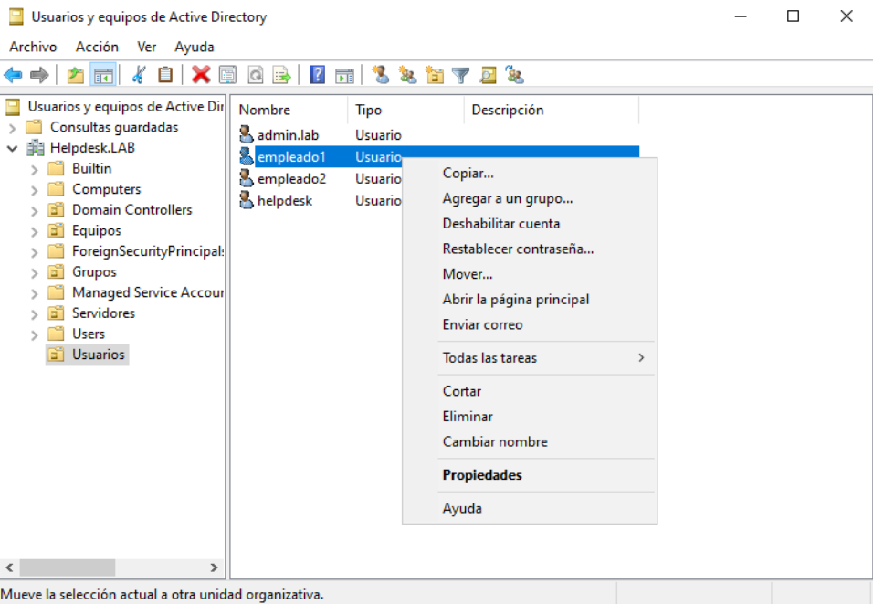
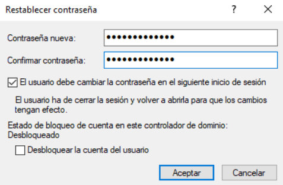

# 🔑 KB-001 | Active Directory Password Reset

> **Status:** ✅ Resolved  
> **Category:** Active Directory  
> **Difficulty:** Easy

---

## 📌 Scenario

A domain user was unable to sign in because the account password had been forgotten.

The issue was resolved by resetting the password through Active Directory and forcing the user to change it at the next logon.

---

## 🖥 Environment

- Windows Server 2022
- Active Directory Domain Services (AD DS)
- Windows 11
- Domain: `helpdesk.lab`

---

## 🔍 Root Cause

The user had forgotten the domain password and was no longer able to authenticate.

---

## 🛠 Resolution

- Open **Active Directory Users and Computers**
- Locate the affected user account
- Reset the password
- Enable **User must change password at next logon**
- Apply the changes
- Verify successful authentication

---

## ✅ Validation

The user successfully signed in using the temporary password and created a new password during the first logon.

---

## 📸 Evidence

### 1. User account

---

### 2. Password reset

---

### 3. Successful password change

---

## 🎯 Skills Demonstrated

- Active Directory administration
- User account management
- Password reset procedures
- Domain authentication
- Helpdesk troubleshooting