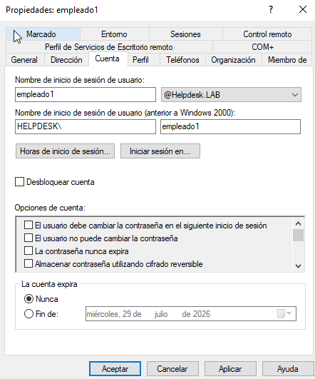
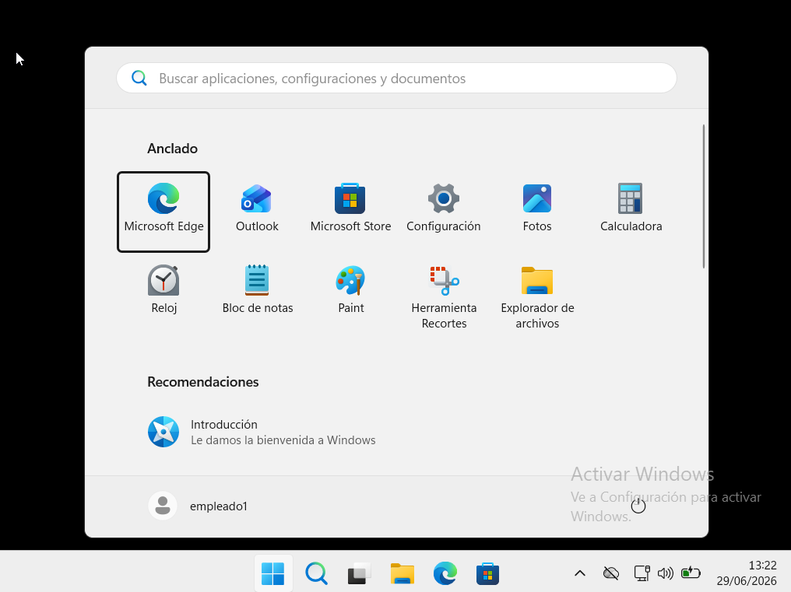

# 🔒 KB-002 | Active Directory Account Lockout

> **Status:** ✅ Resolved  
> **Category:** Active Directory  
> **Difficulty:** Easy

---

## 📌 Scenario

A domain user was unable to sign in because the account had been locked after multiple failed authentication attempts.

The issue was resolved by unlocking the account through Active Directory.

---

## 🖥 Environment

- Windows Server 2022
- Active Directory Domain Services (AD DS)
- Windows 11
- Domain: `helpdesk.lab`

---

## 🔍 Root Cause

The account was automatically locked due to multiple incorrect password attempts, according to the configured domain security policy.

---

## 🛠 Resolution

- Open **Active Directory Users and Computers**
- Locate the affected user account
- Open **Properties → Account**
- Enable the **Unlock account** option
- Apply the changes

---

## ✅ Validation

The user successfully authenticated to the domain after the account was unlocked.

---

## 📸 Evidence

### 1. Unlock account

---

### 2. Successful logon

---

## 🎯 Skills Demonstrated

- Active Directory administration
- User account management
- Account lockout recovery
- Domain authentication troubleshooting
- Helpdesk incident resolution