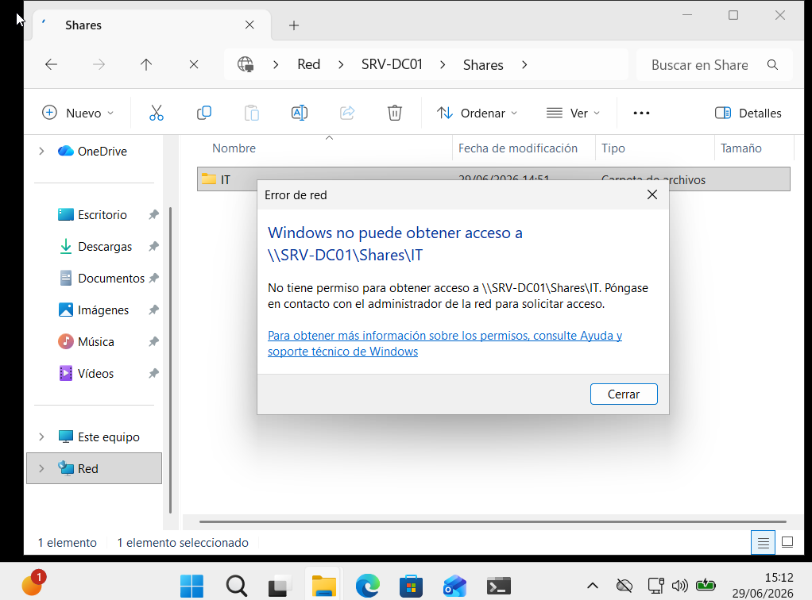
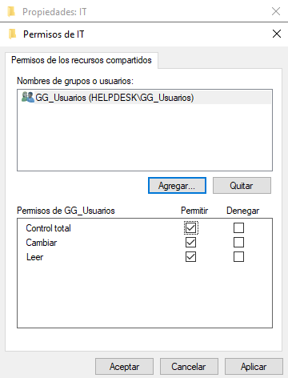
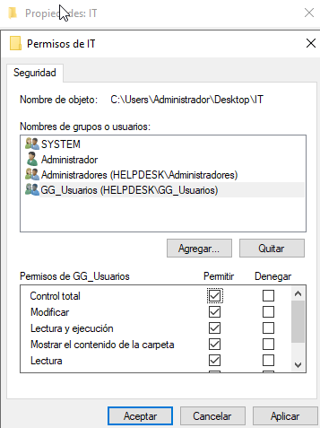
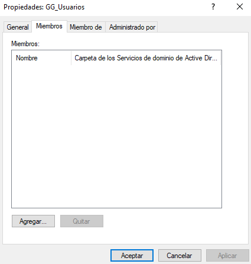
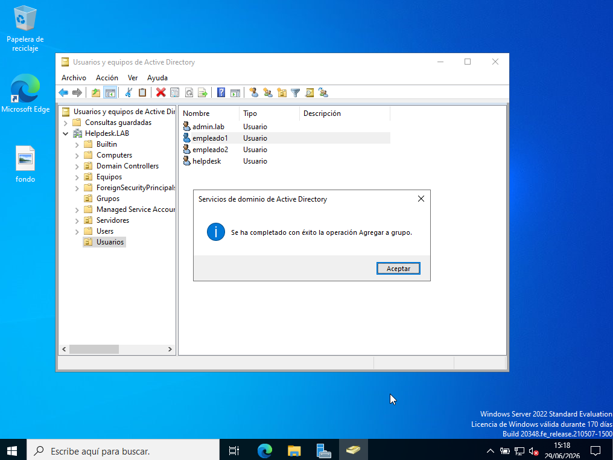
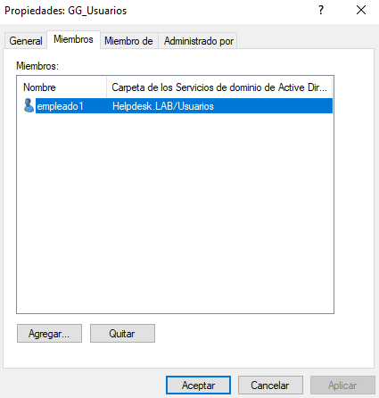
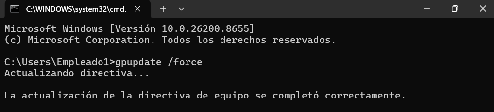
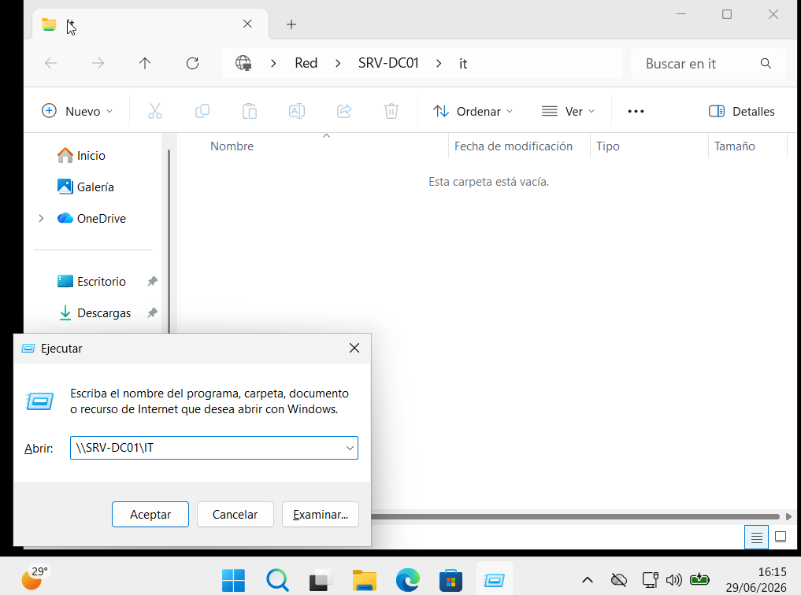

# 🔒 KB-003 | User Unable to Access Shared Folder

> Windows Server 2022 • Active Directory • File Server

## Problem

A domain user (**empleado1**) was unable to access the **IT** shared folder.

The user was **not a member of the `GG_Usuarios` security group** required to access the resource.

---

## Root Cause

- Shared permissions ✔️
- NTFS permissions ✔️
- User not assigned to `GG_Usuarios` ❌

---

## Resolution

- Verified Shared Folder permissions
- Verified NTFS permissions
- Checked `GG_Usuarios`
- Added `empleado1` to `GG_Usuarios`
- Executed:

```powershell
gpupdate /force
```

- Verified access

---

## Result

✅ User successfully accessed the shared folder.

---

## Evidence

### 1. Access denied



### 2. Shared Folder permissions



### 3. NTFS permissions



### 4. Empty `GG_Usuarios`



### 5. Add user to `GG_Usuarios`



### 6. User group membership



### 7. Refresh Group Policy

```powershell
gpupdate /force
```



### 8. Successful access



---

## Skills

- Active Directory
- Security Groups
- NTFS Permissions
- Shared Folder Permissions
- Group Policy
- Windows Server 2022
- Helpdesk Troubleshooting