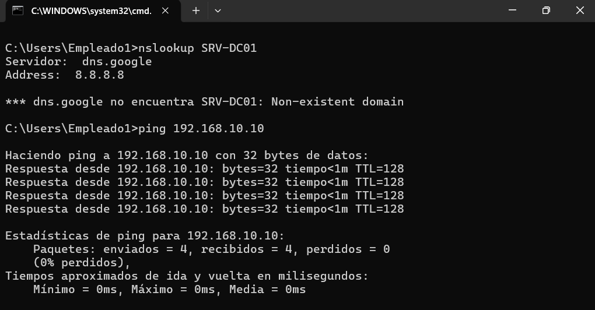
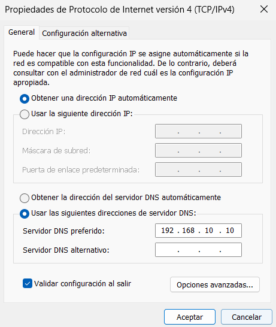
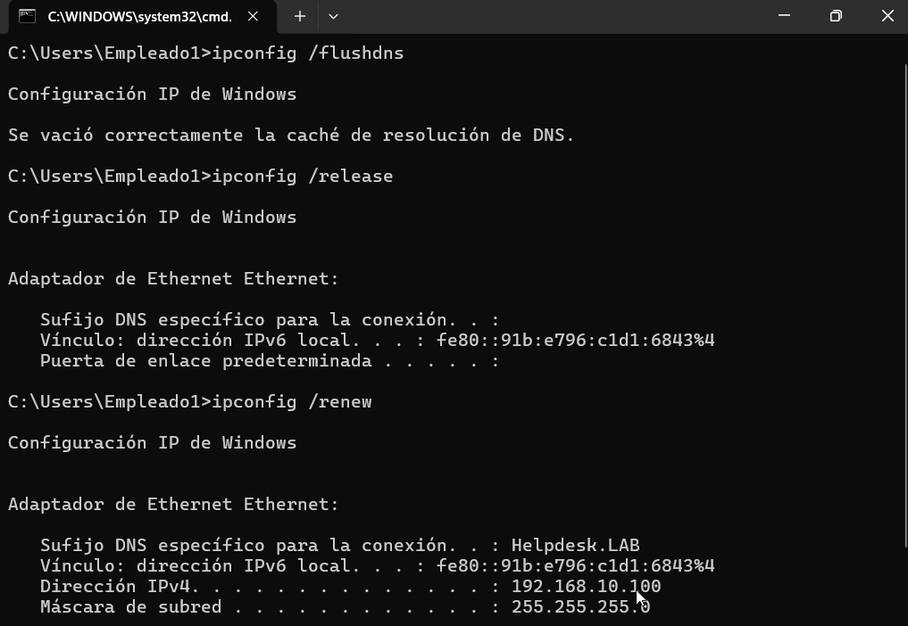
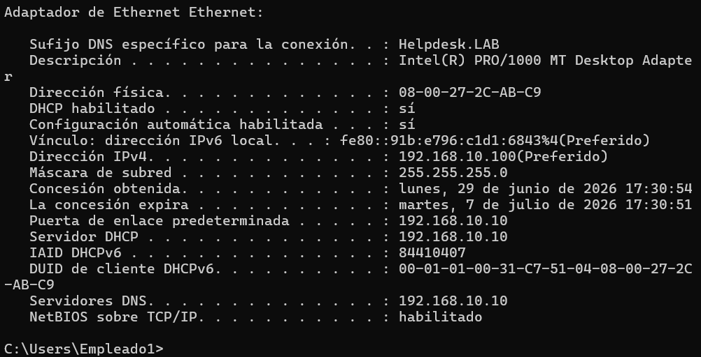
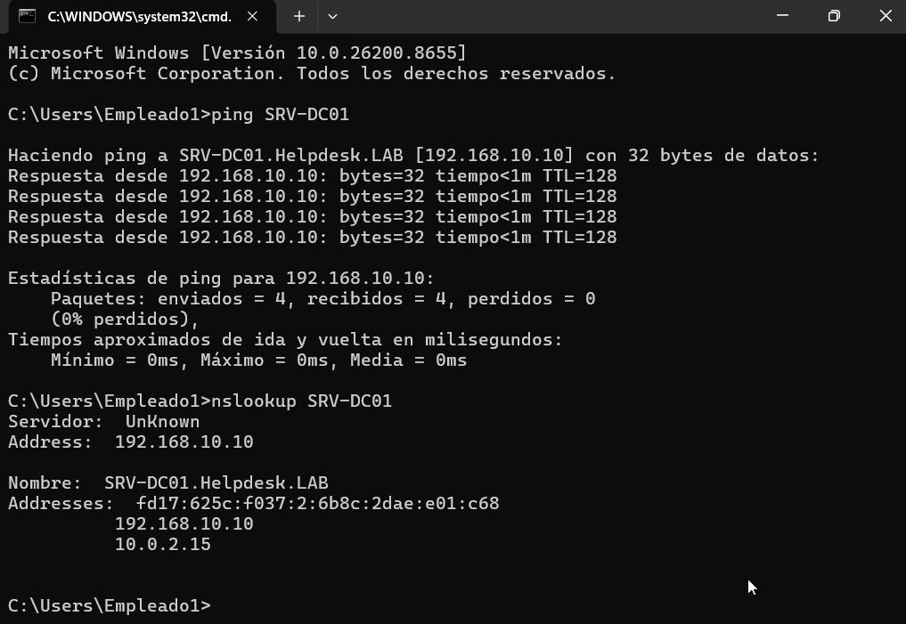
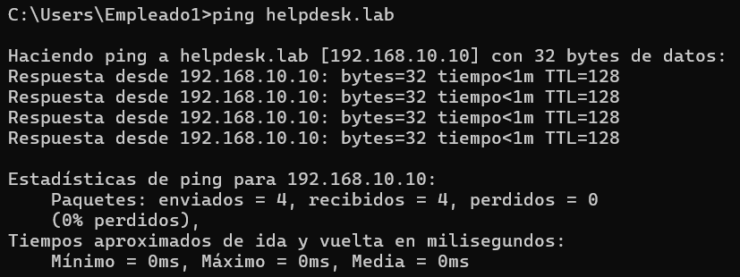

# 🌐 KB-004 | DNS Name Resolution Failure

> Windows Server 2022 • DNS • Windows 11

## Problem

The client computer could successfully reach the domain controller by IP address but was unable to resolve its hostname.

```text
nslookup SRV-DC01

*** dns.google can't find SRV-DC01: Non-existent domain
```

---

## Root Cause

The client was configured to use Google's public DNS server (`8.8.8.8`) instead of the internal DNS server hosted on the domain controller (`192.168.10.10`).

Because of this, DNS queries for the **helpdesk.lab** domain could not be resolved.

---

## Resolution

Configure the preferred DNS server:

```text
Preferred DNS Server

192.168.10.10
```

Clear the DNS cache and renew the network configuration.

```powershell
ipconfig /flushdns
ipconfig /release
ipconfig /renew
```

Verify the new network configuration.

```powershell
ipconfig /all
```

Confirm successful name resolution.

```powershell
nslookup SRV-DC01
ping SRV-DC01
ping helpdesk.lab
```

---

## Result

✅ DNS name resolution restored.

The client successfully resolved:

- `SRV-DC01`
- `SRV-DC01.helpdesk.lab`
- `helpdesk.lab`

---

## Evidence

### DNS resolution failure



### Configure DNS server



### Flush DNS cache and renew IP configuration



### Verify DNS configuration



### Successful DNS resolution



### Domain connectivity verification



---

## Commands Used

```powershell
nslookup SRV-DC01

ipconfig /flushdns
ipconfig /release
ipconfig /renew
ipconfig /all

ping SRV-DC01
ping helpdesk.lab
```

---

## Skills

- Windows Server DNS
- DNS Troubleshooting
- TCP/IP Configuration
- Name Resolution
- Windows Networking
- Helpdesk Troubleshooting