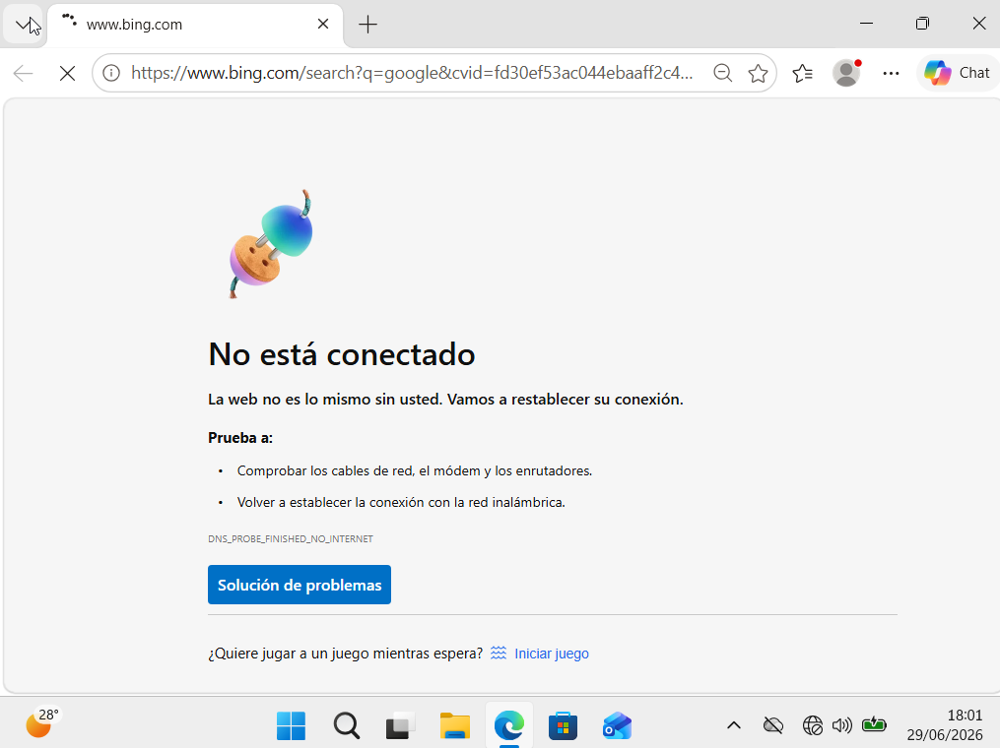
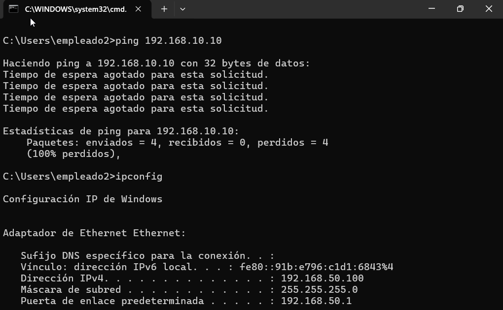
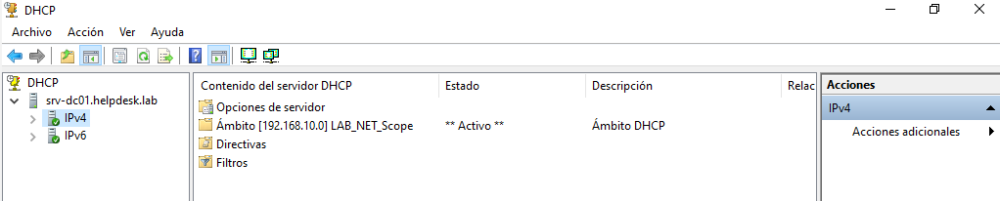
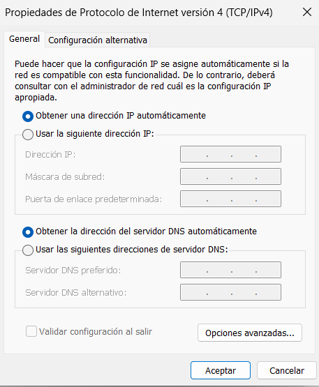
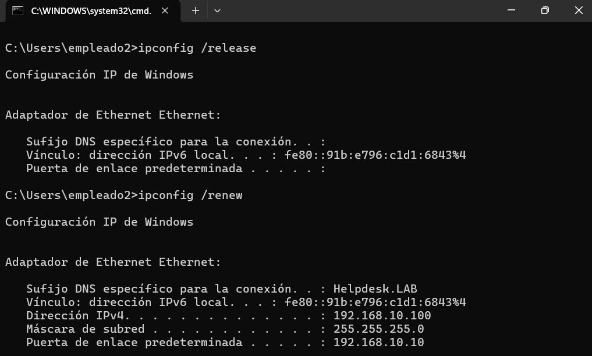
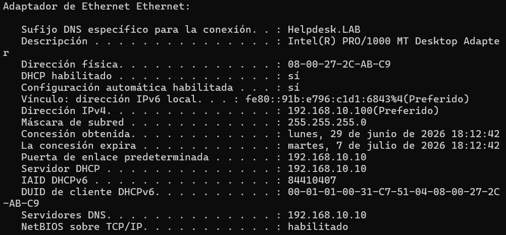
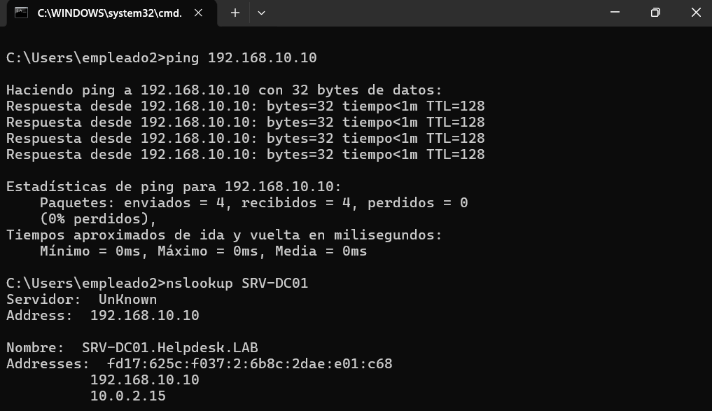
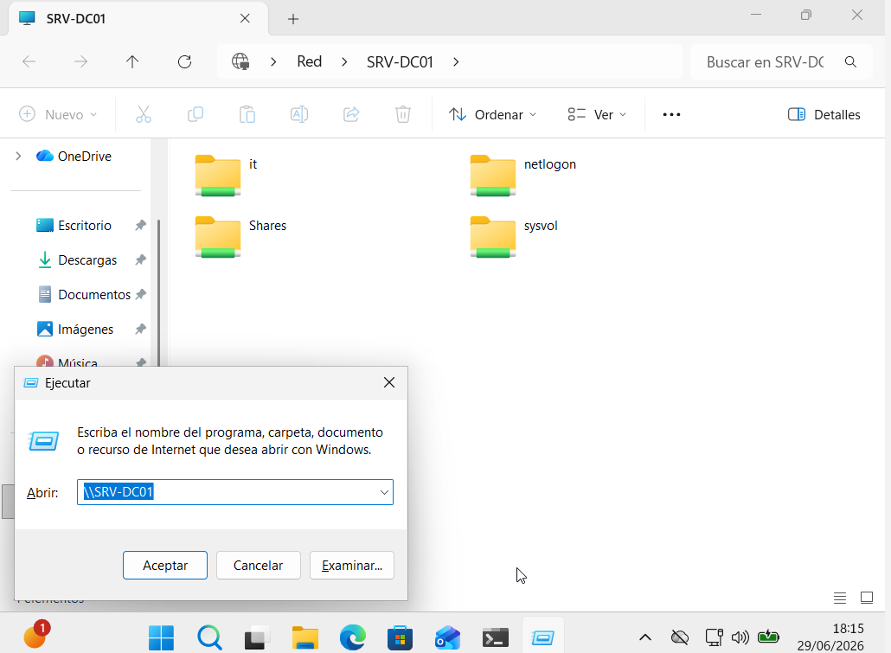

# 📡 KB-005 | Client Unable to Obtain Network Configuration via DHCP

> Windows Server 2022 • DHCP • Windows 11

## Problem

The client workstation (**empleado2**) was disconnected from the corporate network.

Symptoms included:

- No Internet access
- Unable to reach the domain controller
- Unable to access shared folders
- Windows reported that the computer could not communicate with the domain

```text
ping 192.168.10.10

Request timed out.
```

---

## Root Cause

The client was using an incorrect network configuration and was not obtaining its IP address from the corporate DHCP server.

Current configuration:

```text
IPv4 Address : 192.168.50.100
Gateway      : 192.168.50.1
```

---

## Resolution

Verify that the DHCP Server service is running.

Configure the network adapter to obtain the IP address automatically.

```text
✔ Obtain an IP address automatically
✔ Obtain DNS server address automatically
```

Renew the DHCP lease.

```powershell
ipconfig /release
ipconfig /renew
```

Verify the new network configuration.

```powershell
ipconfig /all
```

Validate network connectivity.

```powershell
ping 192.168.10.10
nslookup SRV-DC01
```

Verify access to the shared folder and Internet connectivity.

---

## Result

✅ Network connectivity restored.

The client successfully:

- Received an IP address from the DHCP server
- Communicated with the domain controller
- Resolved DNS names
- Accessed shared folders
- Connected to the Internet

---

## Evidence

### No Internet connectivity



### Incorrect network configuration



### DHCP Server verification



### Configure automatic IP assignment



### Renew DHCP lease



### Verify DHCP configuration



### Network connectivity restored



### Shared folder access



### Internet connectivity restored


---

## Commands Used

```powershell
ipconfig

ipconfig /release
ipconfig /renew
ipconfig /all

ping 192.168.10.10
nslookup SRV-DC01
```

---

## Skills

- Windows Server DHCP
- DHCP Troubleshooting
- TCP/IP Configuration
- Network Connectivity
- Windows Networking
- Helpdesk Troubleshooting