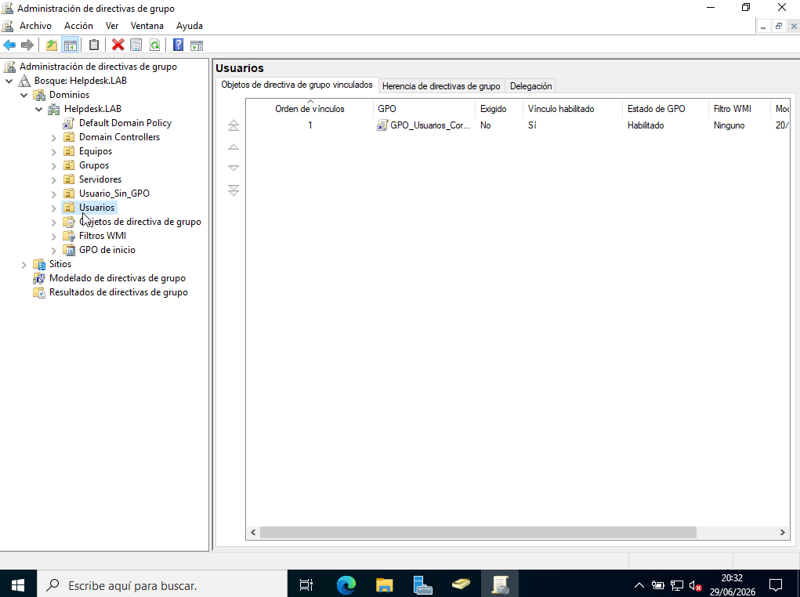
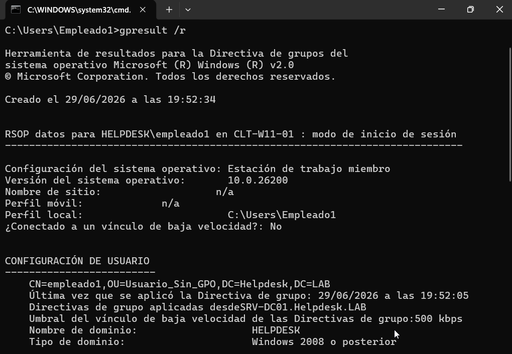
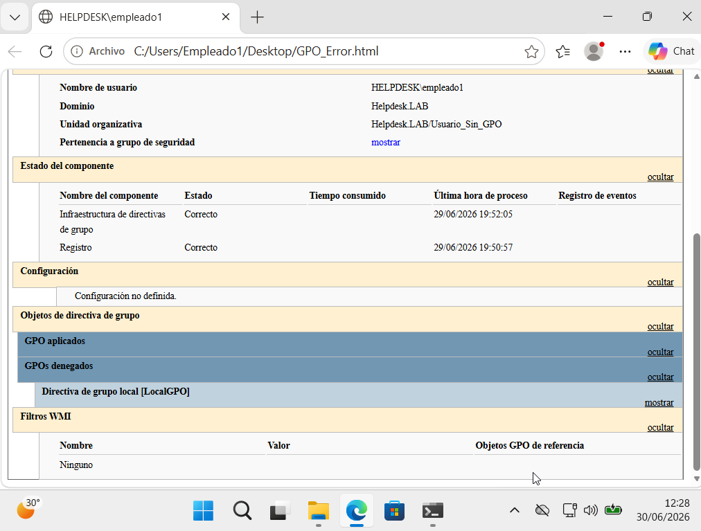
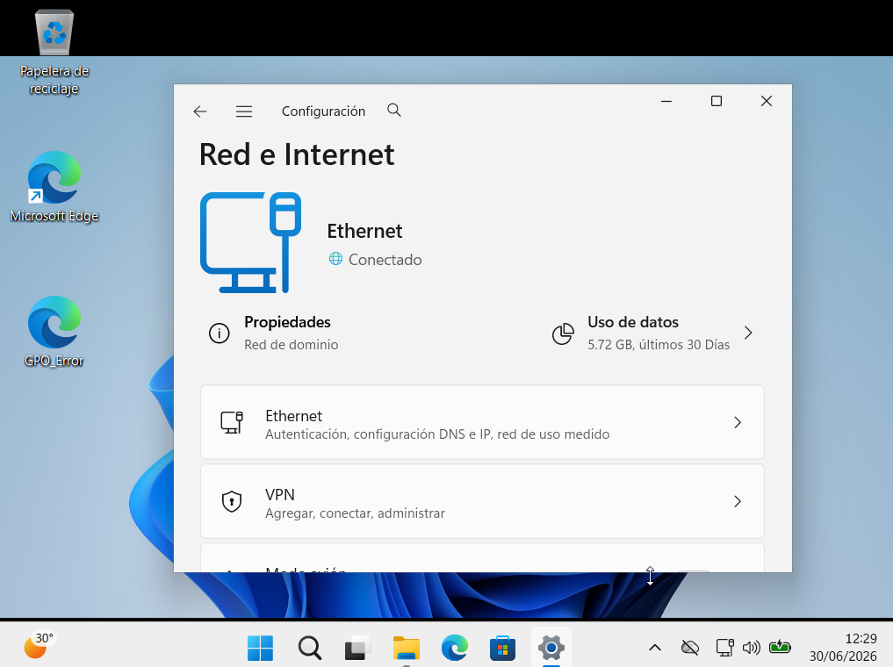
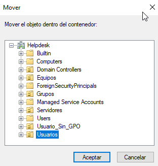
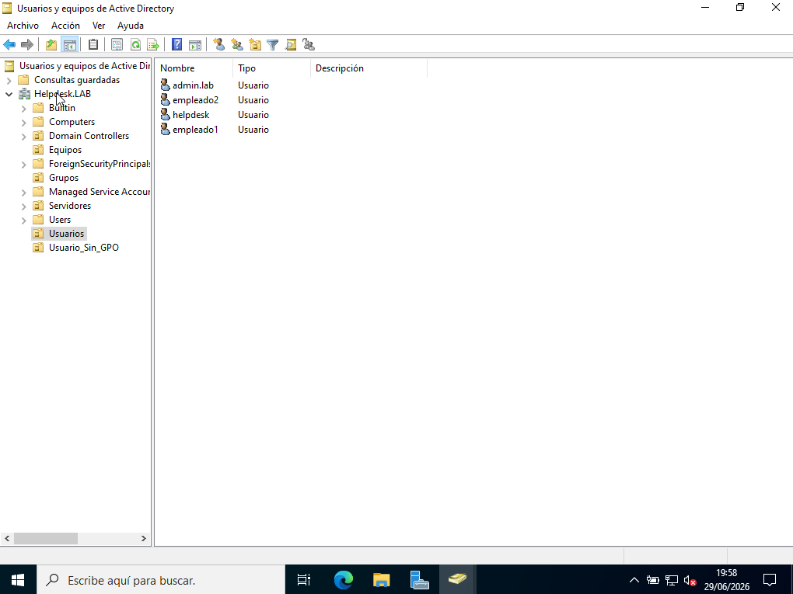
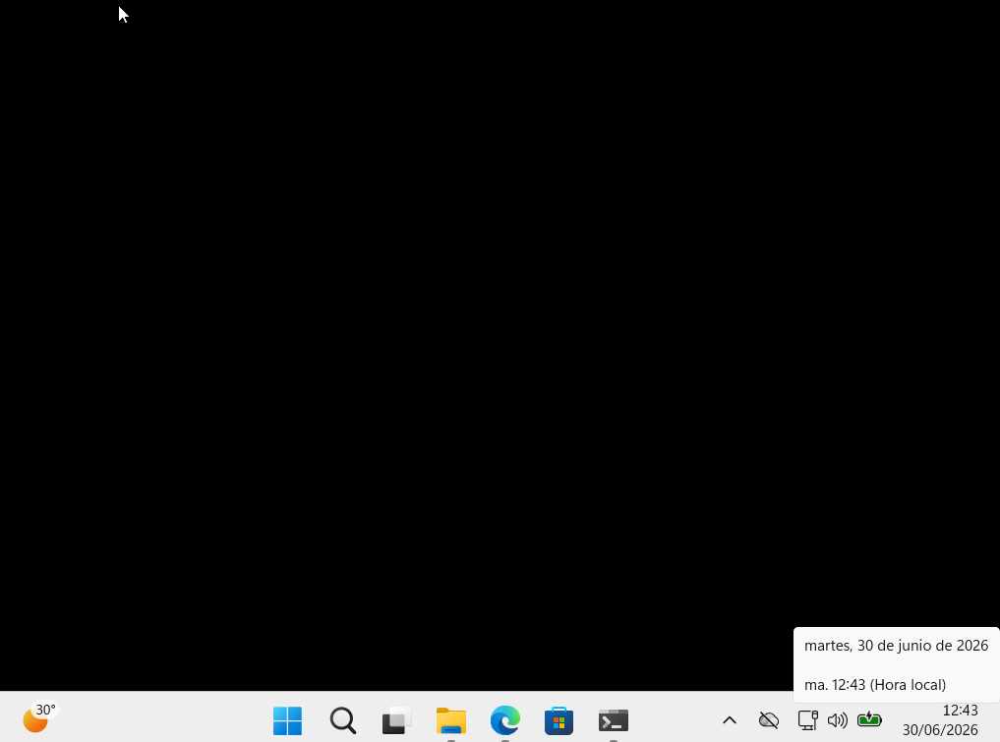
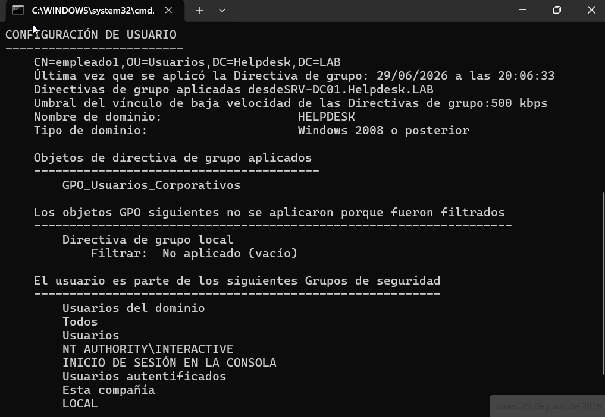
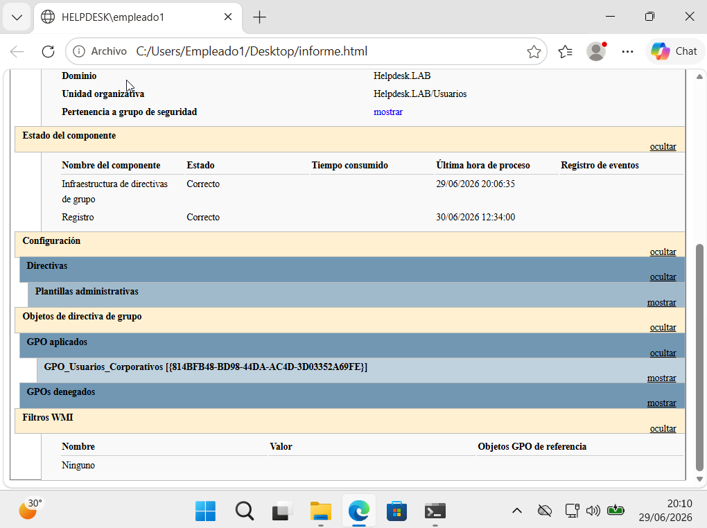

# 🛡️ KB-006 | Group Policy Not Applied to Domain User

> Windows Server 2022 • Group Policy • Windows 11

## Problem

The user (**empleado1**) reported that the corporate Group Policy settings were no longer being applied.

Symptoms included:

- Corporate desktop wallpaper missing
- Security restrictions not applied
- Full access to Windows settings

```powershell
gpresult /r
```

```text
No Group Policy Objects were applied.
```

---

## Root Cause

The Group Policy Object (**GPO_Usuarios_Corporativos**) was correctly configured.

However, the affected user had been moved to the **Usuario_Sin_GPO** Organizational Unit, preventing the policy from being applied.

---

## Resolution

Verify that the GPO is correctly linked.

```text
GPO_Usuarios_Corporativos
```

Check applied policies.

```powershell
gpresult /r
```

Generate a detailed Group Policy report.

```powershell
gpresult /h C:\Users\Empleado1\Desktop\GPO_Error.html
```

Move the affected user back to the **Usuarios** Organizational Unit.

Verify the applied policies again.

```powershell
gpresult /r
gpresult /h C:\Users\Empleado1\Desktop\Informe.html
```

---

## Result

✅ The Group Policy was successfully applied.

The workstation recovered:

- Corporate desktop wallpaper
- Corporate restrictions
- Security settings
- Correct Group Policy processing

---

## Evidence

### GPO linked to the Users OU



### User located in the wrong OU


### No Group Policies applied



### Group Policy HTML report (error)



### Workstation without corporate policy



### Move user to the correct OU



### Users OU verification



### Corporate policy successfully applied



### gpresult verification



### Group Policy HTML report (success)



---

## Commands Used

```powershell
gpresult /r

gpresult /h C:\Users\Empleado1\Desktop\GPO_Error.html

gpresult /h C:\Users\Empleado1\Desktop\Informe.html
```

---

## Skills

- Group Policy
- Active Directory
- Organizational Units (OU)
- Group Policy Troubleshooting
- gpresult
- Windows Administration
- Helpdesk Troubleshooting