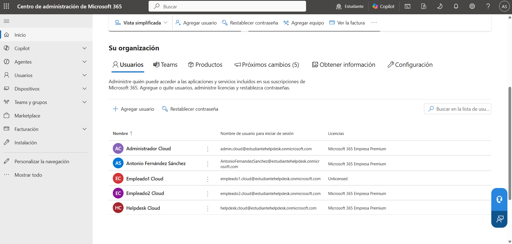
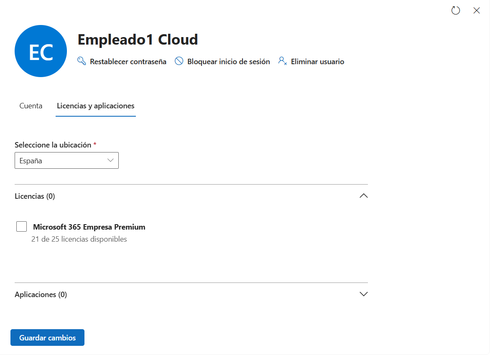
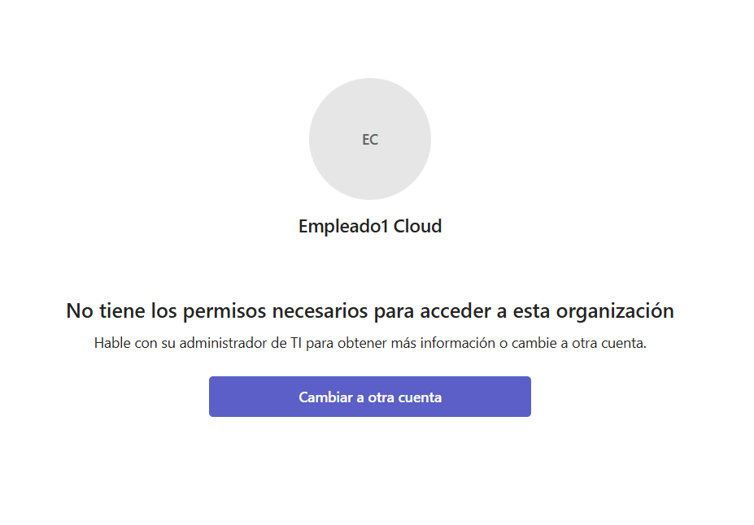
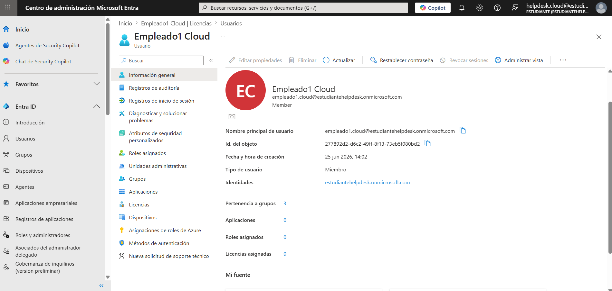
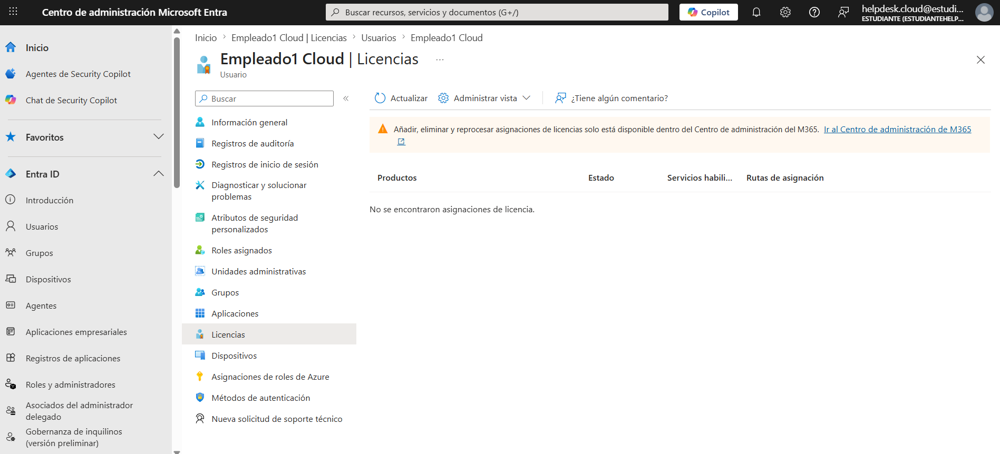
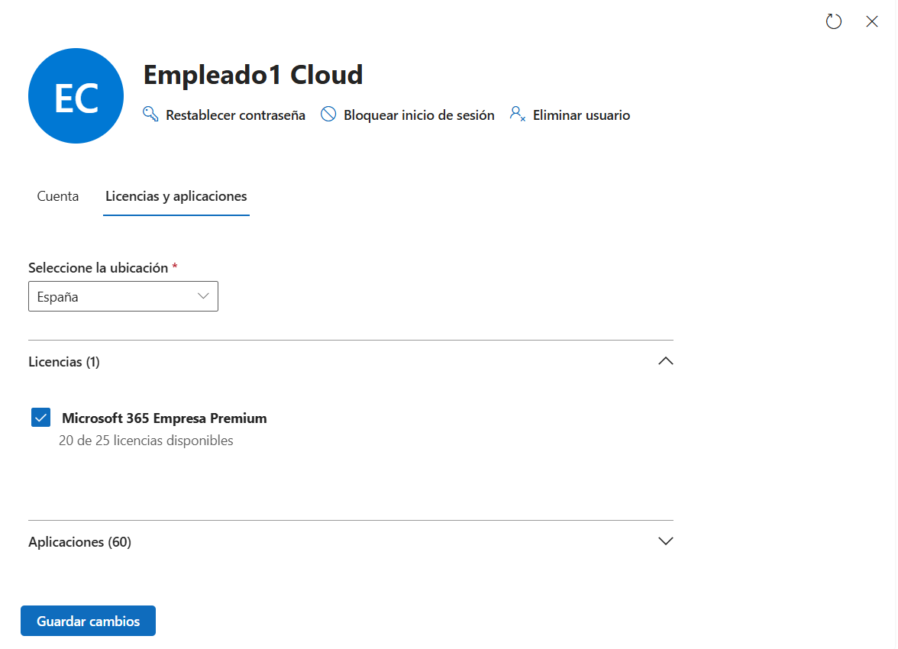
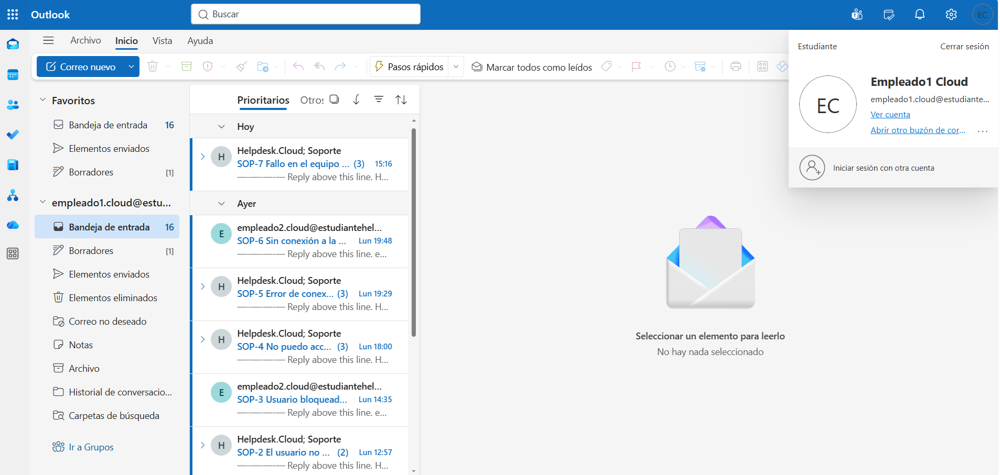
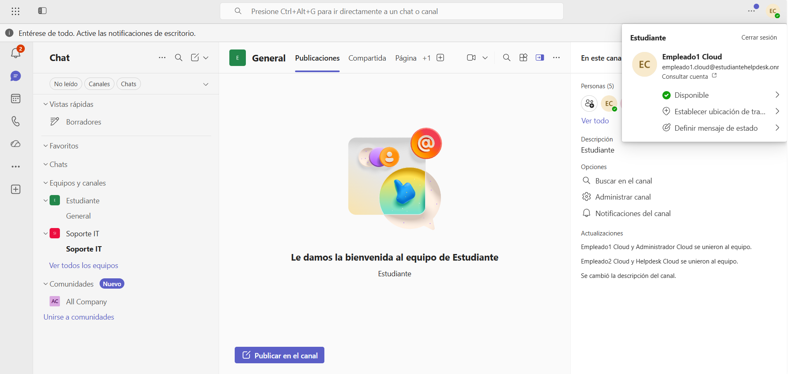
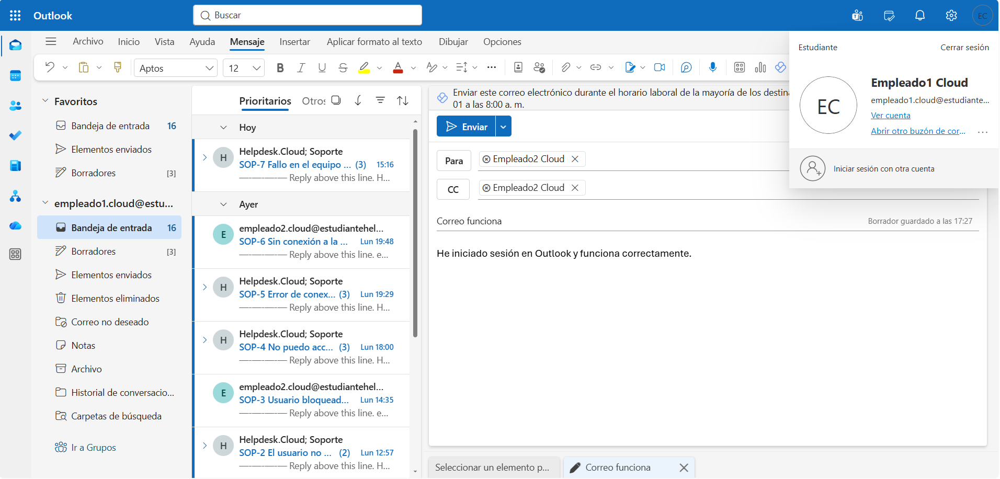
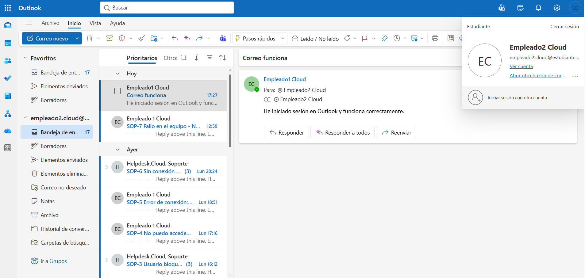

# ☁️ KB-007 | Microsoft 365 License Assignment

> Microsoft 365 • Exchange Online • Microsoft Teams

## Problem

The user (**empleado1.cloud@estudiantehelpdesk.onmicrosoft.com**) reported that Microsoft 365 services were unavailable.

Although the user could successfully authenticate, services such as **Outlook** and **Microsoft Teams** could not be accessed.

---

## Root Cause

The user account existed in Microsoft Entra ID and authentication was successful.

However, no Microsoft 365 license had been assigned to the account.

---

## Resolution

Locate the affected user in the Microsoft 365 Admin Center.

Verify the assigned licenses.

Assign the following license:

```text
Microsoft 365 Business Premium
```

Wait for the license assignment to complete.

Verify access to Microsoft 365 services.

---

## Result

✅ Microsoft 365 services restored.

The user successfully:

- Accessed Outlook
- Accessed Microsoft Teams
- Sent emails
- Received emails

---

## Evidence

### Microsoft 365 Admin Center



### User without license



### Outlook access error


### Microsoft Teams access error



### User overview



### License verification



### Assign Microsoft 365 Business Premium



### Outlook working



### Microsoft Teams working



### Email sent successfully



### Email received successfully



---

## Skills

- Microsoft 365 Administration
- License Management
- Exchange Online
- Microsoft Teams
- Microsoft Entra ID
- User Administration
- Helpdesk Troubleshooting