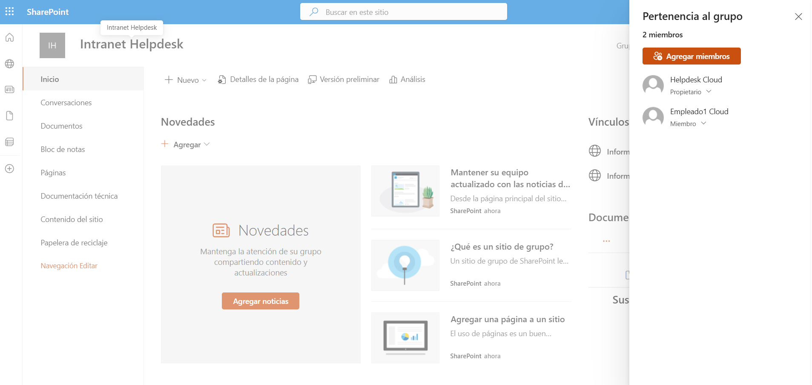
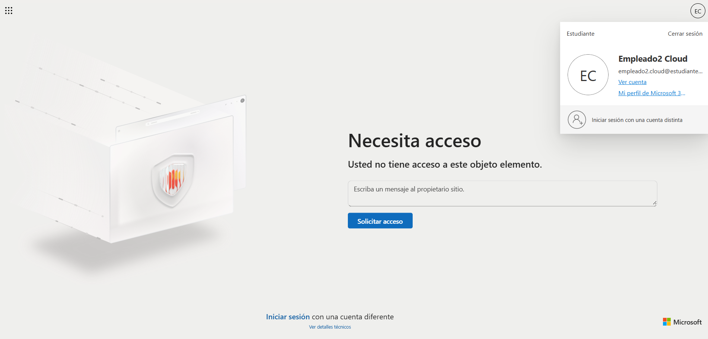
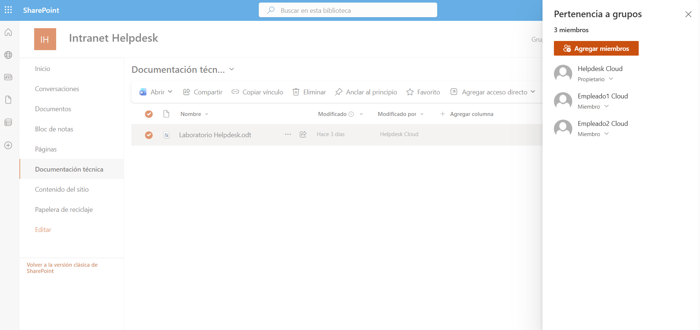
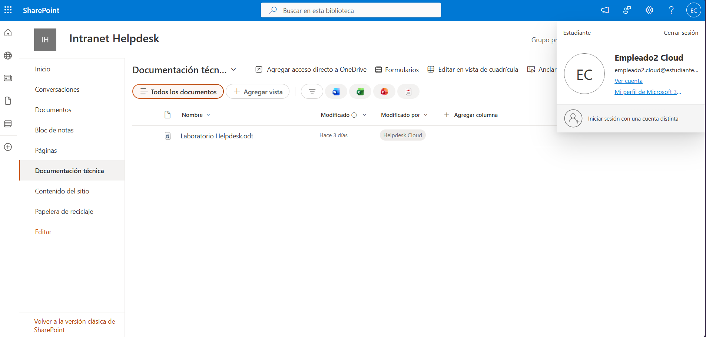
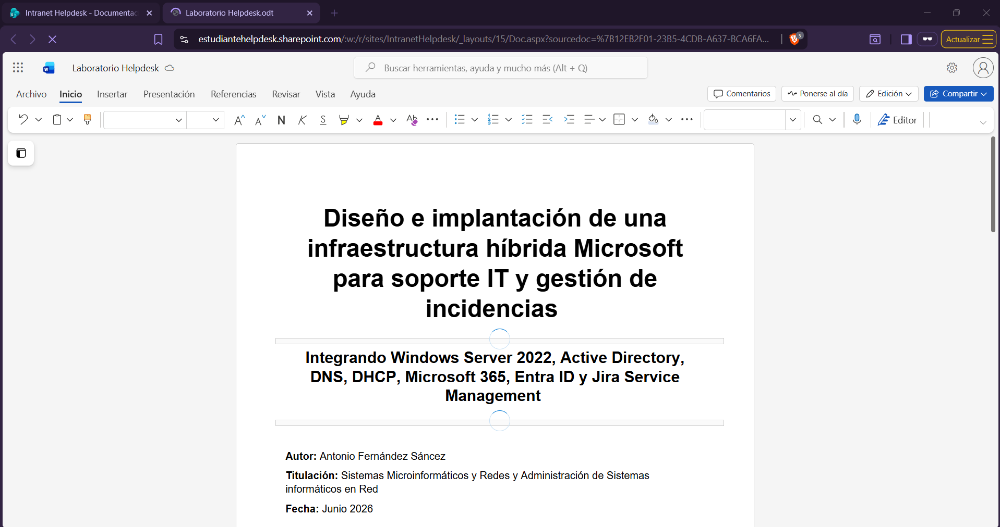

# 📄 KB-008 | SharePoint Site Access Denied

> Microsoft 365 • SharePoint Online

## Problem

The user (**empleado2.cloud@estudiantehelpdesk.onmicrosoft.com**) reported that access to the **Intranet Helpdesk** SharePoint site was denied.

The user previously had access to the site but was now receiving an **Access Denied** message.

---

## Root Cause

The affected user had been removed from the **Intranet Helpdesk Members** SharePoint group.

As a result, the user no longer had permission to access the site or its documents.

---

## Resolution

Review the SharePoint site permissions.

Locate the **Intranet Helpdesk Members** group.

Add the affected user back to the Members group.

Verify access to the SharePoint site.

Confirm that documents can be opened successfully.

---

## Result

✅ SharePoint access restored.

The user successfully:

- Accessed the **Intranet Helpdesk** site
- Browsed the document library
- Opened the **Laboratorio Helpdesk** document

---

## Evidence

### Review SharePoint site permissions

### Access denied

### Restore user permissions

### Successful access to the SharePoint site

### Document opened successfully

---

## Admin Tools

- Microsoft 365 Admin Center
- SharePoint Online
- SharePoint Site Permissions

---

## Skills

- SharePoint Online
- Permission Management
- Microsoft 365 Administration
- User Access Management
- SharePoint Security
- Helpdesk Troubleshooting