# 👤 KB-009 | User Onboarding

> Windows Server 2022 • Active Directory • Microsoft 365

## Request

The Human Resources department requested the onboarding of a new employee joining the IT Support team.

The request included:

- Corporate user account
- Domain access
- Security groups
- Microsoft 365 services
- Microsoft Teams
- SharePoint
- Exchange Online
- Shared resources

---

## Tasks Performed

### Active Directory

- Created the domain user account
- Configured the initial password
- Added the user to the `GG_Usuarios` security group

### Microsoft Entra ID

- Created the cloud user account

### Microsoft 365

Assigned the following license:

```text
Microsoft 365 Business Premium
```

### Microsoft Teams

Added the user to:

```text
Soporte IT
```

### SharePoint

Granted access to:

```text
Intranet Helpdesk
```

### Network

Verified DHCP configuration.

```powershell
ipconfig
```

### Validation

Verified access to:

- Outlook
- Exchange Online
- Microsoft Teams
- SharePoint
- Shared resources

---

## Result

✅ New employee successfully onboarded.

The user was able to:

- Sign in to the domain
- Receive network configuration
- Access Outlook
- Send and receive emails
- Access Microsoft Teams
- Join the IT Support team
- Access the SharePoint site
- Open corporate documentation

---

## Evidence

### Create Active Directory user

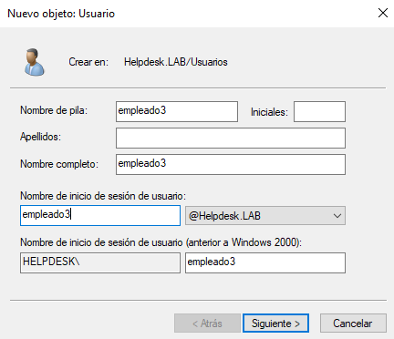

### Configure initial password

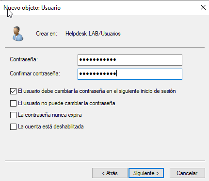

### Add user to security group

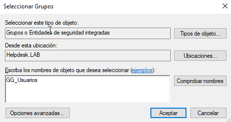

### Verify group membership

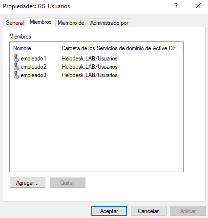

### Create Microsoft Entra ID user

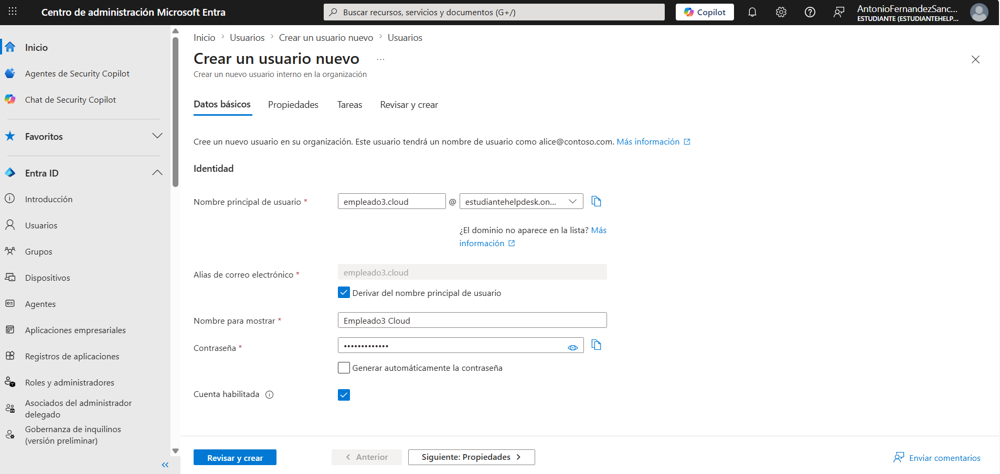

### Assign Microsoft 365 license

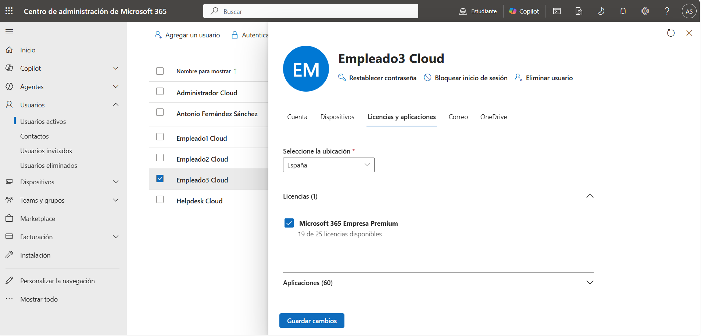

### Add user to Microsoft Teams

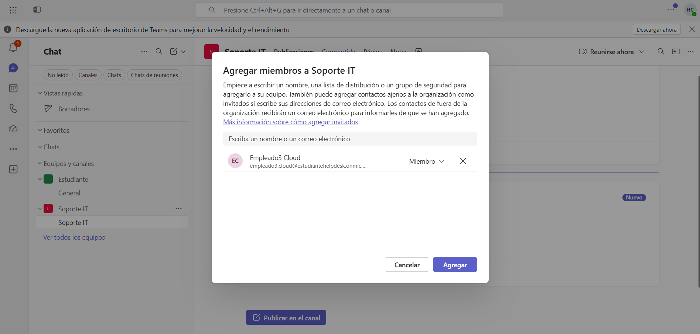

### Grant SharePoint access

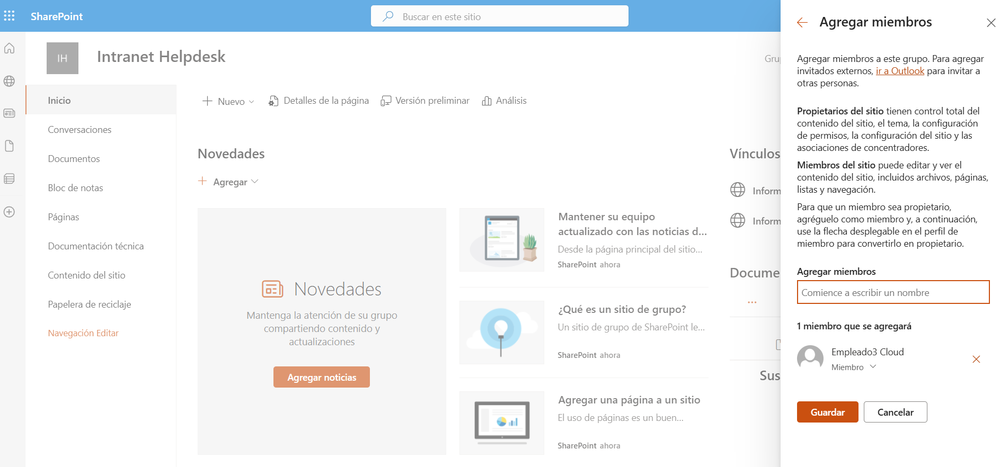

### Verify network configuration

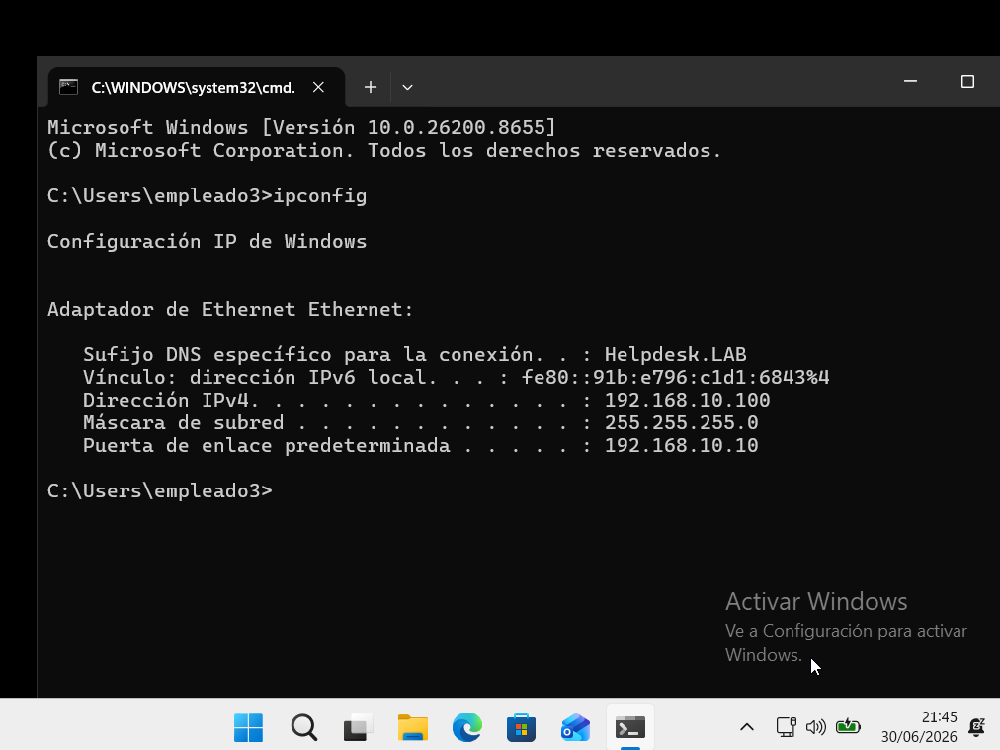

### Outlook access

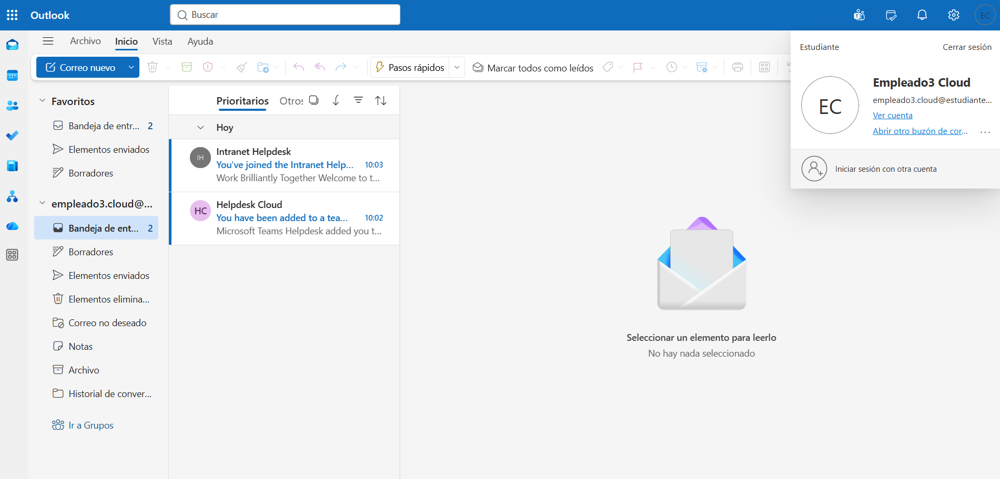

### Send email

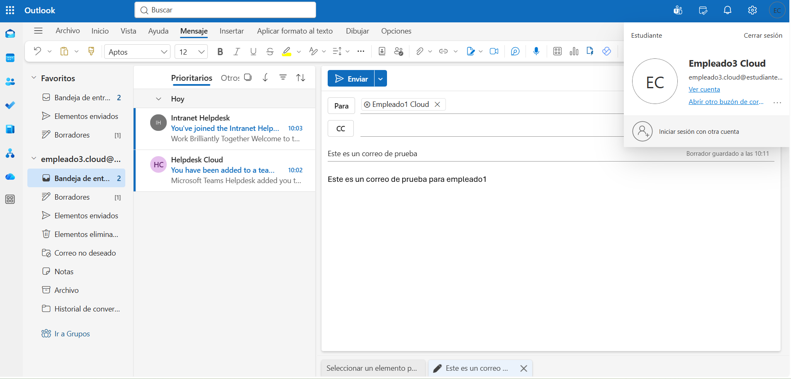

### Receive email

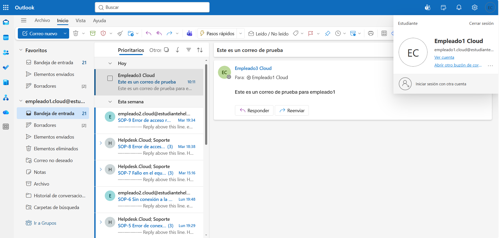

### Microsoft Teams access

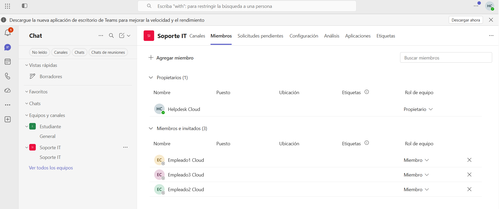

### SharePoint access

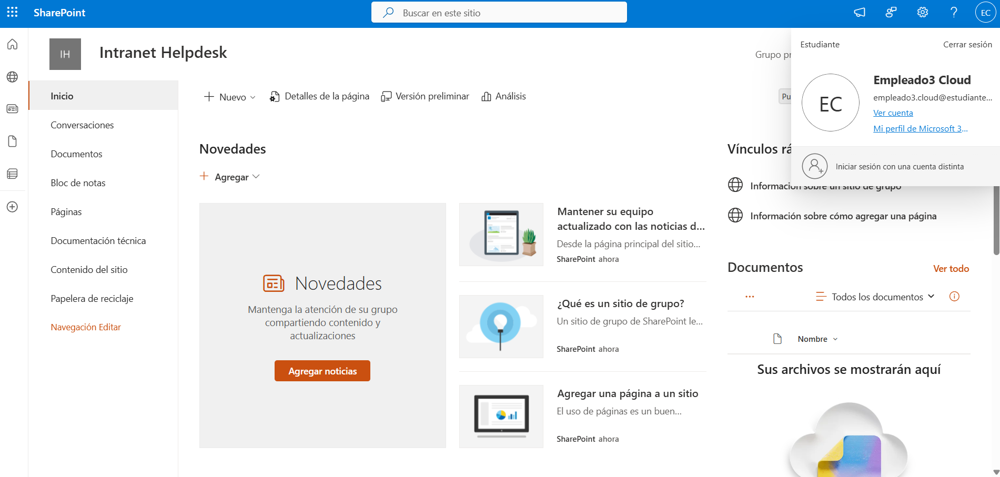

### Open technical documentation

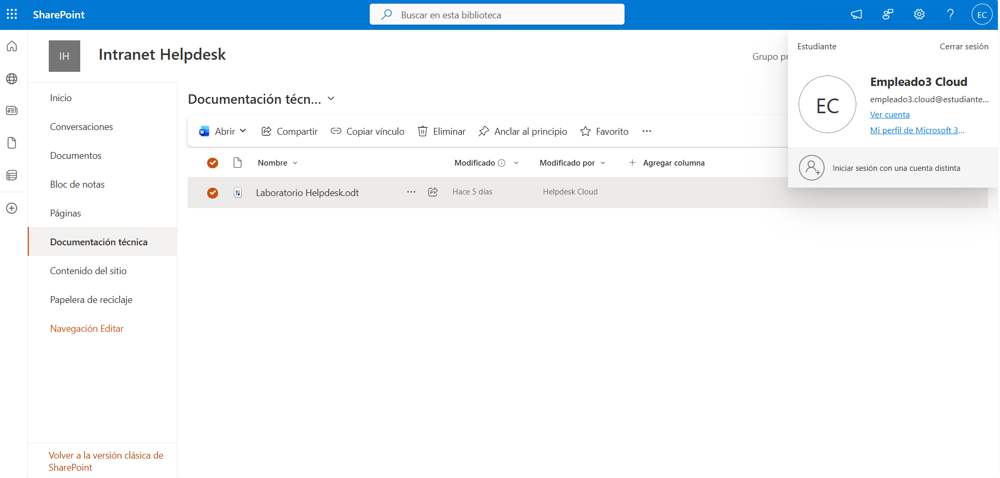

---

## Admin Tools

- Active Directory Users and Computers
- Microsoft Entra Admin Center
- Microsoft 365 Admin Center
- Microsoft Teams Admin Center
- SharePoint Online

---

## Commands Used

```powershell
ipconfig
```

---

## Skills

- Active Directory
- Microsoft Entra ID
- Microsoft 365 Administration
- Exchange Online
- Microsoft Teams
- SharePoint Online
- Security Groups
- User Provisioning
- Helpdesk Operations