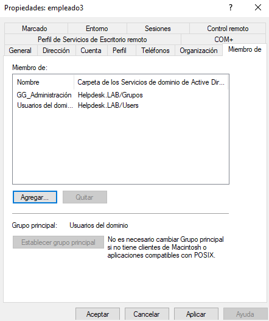
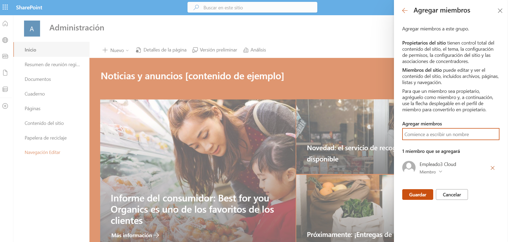
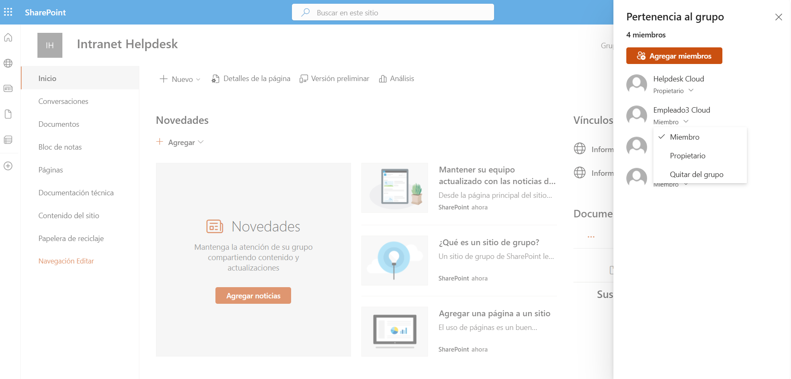
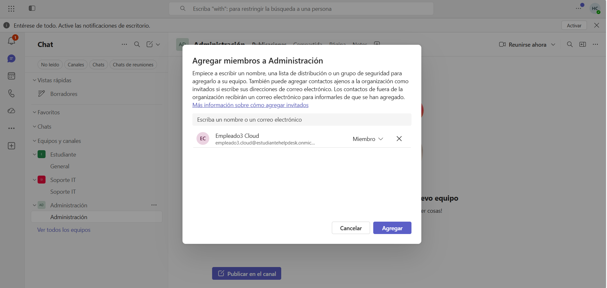
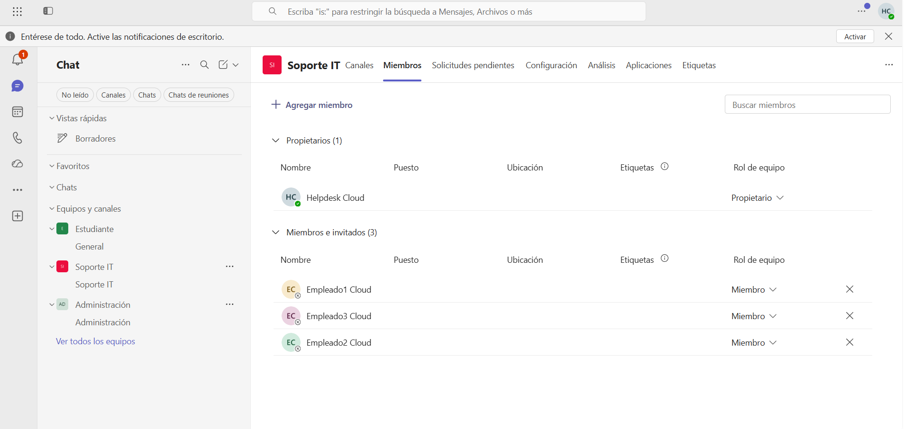
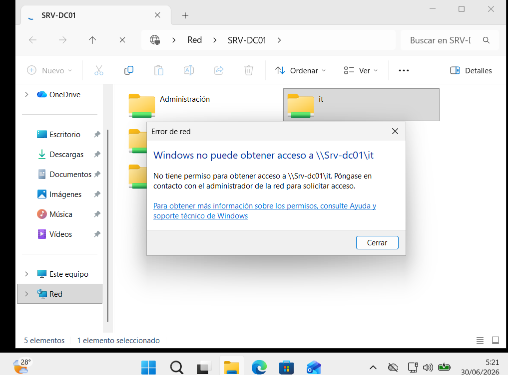
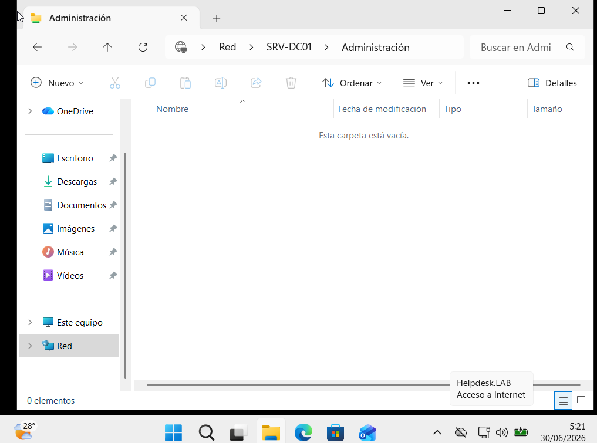
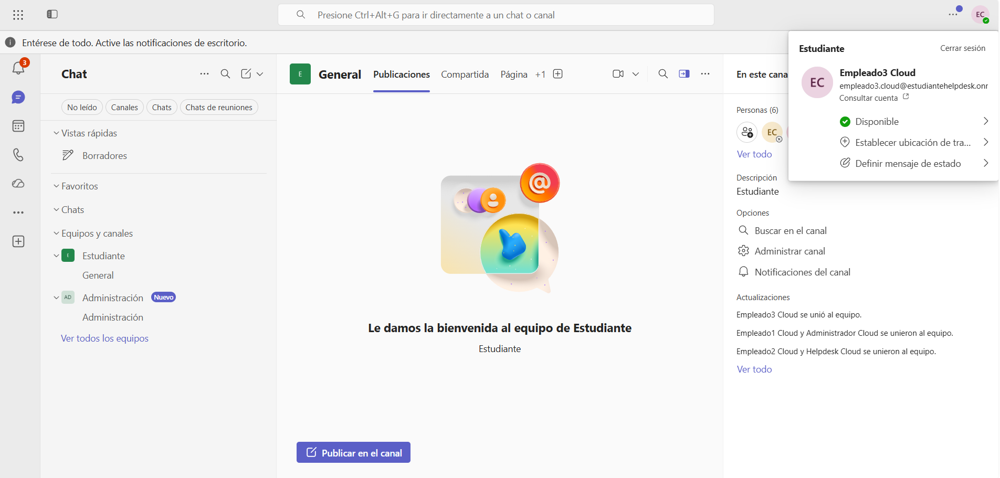
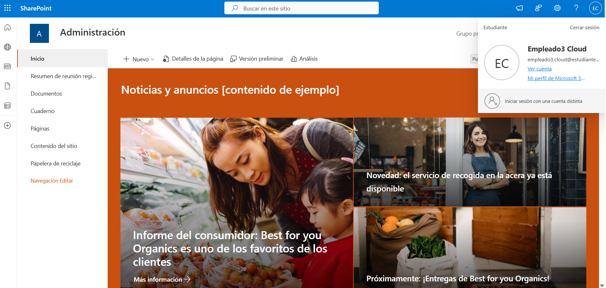
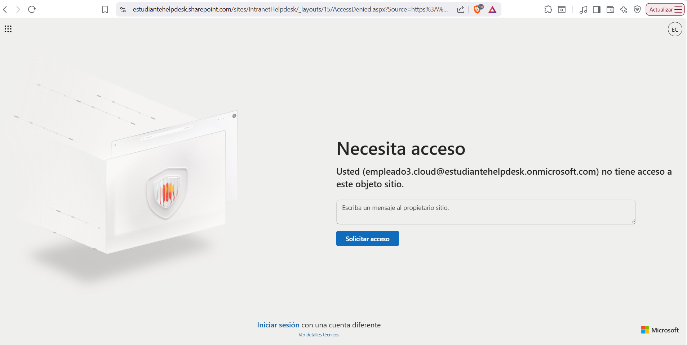

# 🔄 KB-010 | User Department Transfer

> Windows Server 2022 • Microsoft 365 • Microsoft Teams • SharePoint Online

## Request

The Human Resources department informed IT that **empleado3.lab** had been transferred from the **IT Support** department to the **Administration** department.

As part of the department transfer, the user's access to IT resources had to be revoked and new permissions assigned for the Administration department.

---

## Tasks Performed

### Active Directory

Reviewed the user's current group membership.

### SharePoint Online

Granted access to:

```text
Administration
```

Removed access to:

```text
Intranet Helpdesk
```

### Microsoft Teams

Added the user to:

```text
Administration
```

Removed the user from:

```text
Soporte IT
```

### Validation

Verified that the user:

- Lost access to the IT shared folder
- Gained access to the Administration shared folder
- Could only access the Administration Team
- Could access the Administration SharePoint site
- Could no longer access the Intranet Helpdesk site

---

## Result

✅ Department transfer completed successfully.

The user's permissions were updated according to the new job role, ensuring access only to Administration resources.

---

## Evidence

### Review current group membership



### Grant SharePoint Administration access



### Remove Intranet Helpdesk access



### Add user to Administration Team



### Remove user from IT Support Team



### Access denied to IT shared folder



### Successful access to Administration shared folder



### Microsoft Teams validation



### SharePoint Administration access



### Access denied to Intranet Helpdesk



---

## Admin Tools

- Active Directory Users and Computers
- Microsoft Teams Admin Center
- SharePoint Online

---

## Skills

- Active Directory
- Microsoft Teams Administration
- SharePoint Online
- Access Management
- User Lifecycle Management
- Least Privilege Principle
- Helpdesk Operations