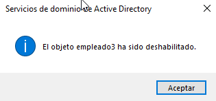
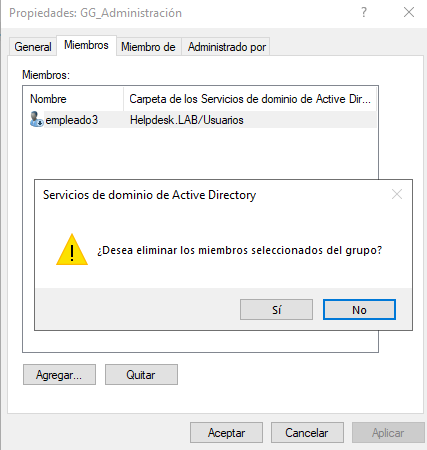
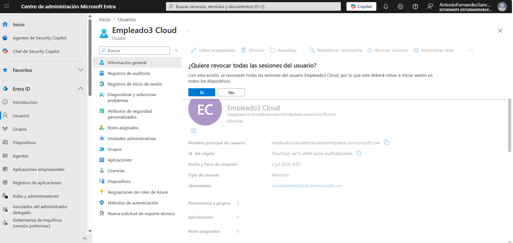
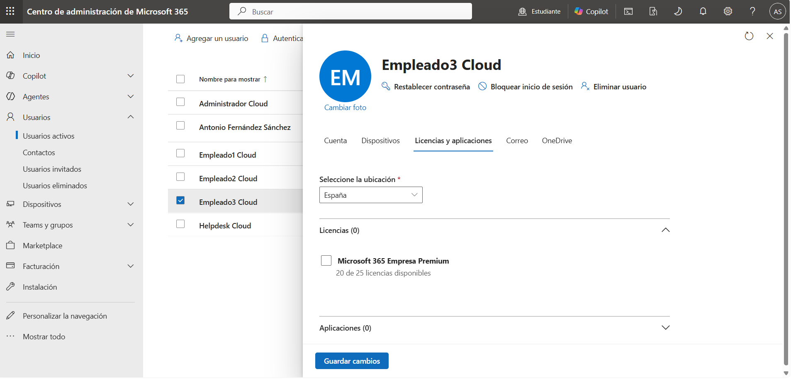
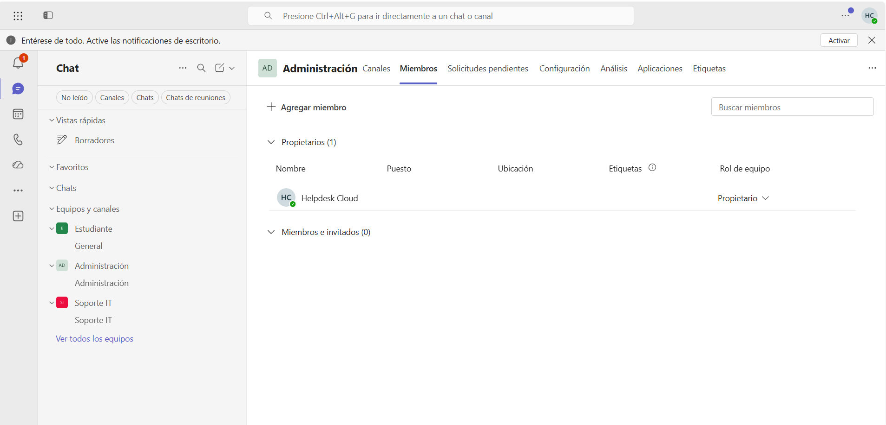
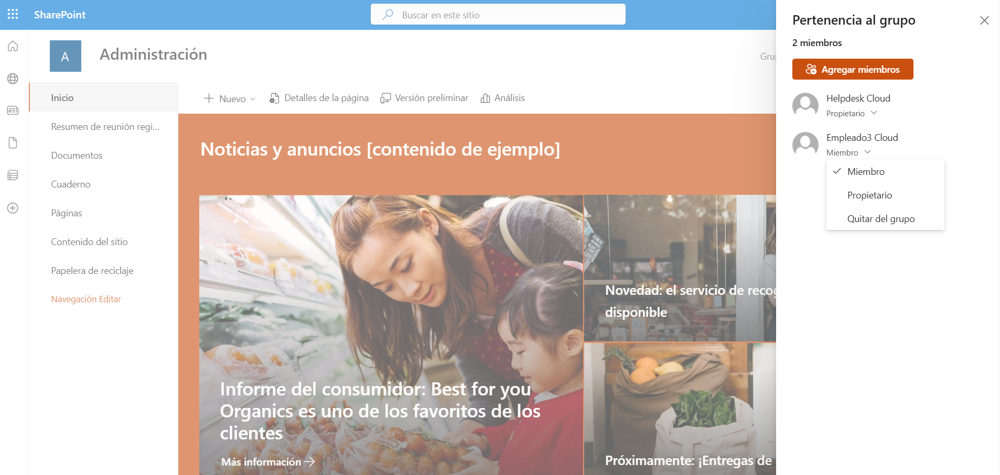
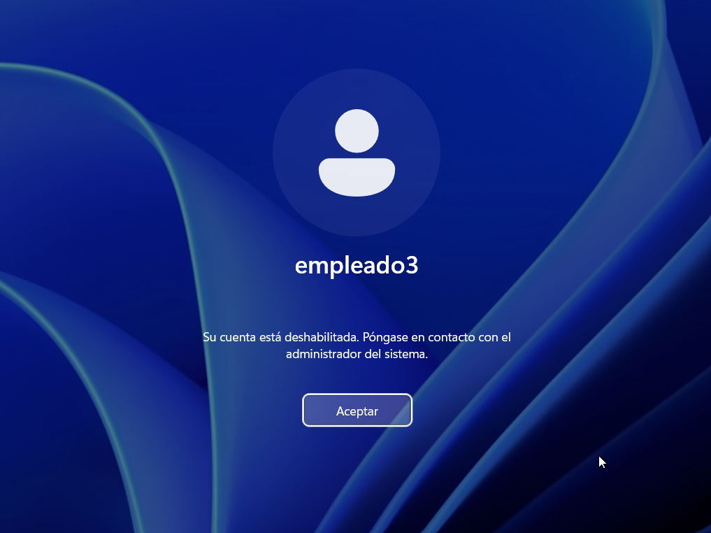
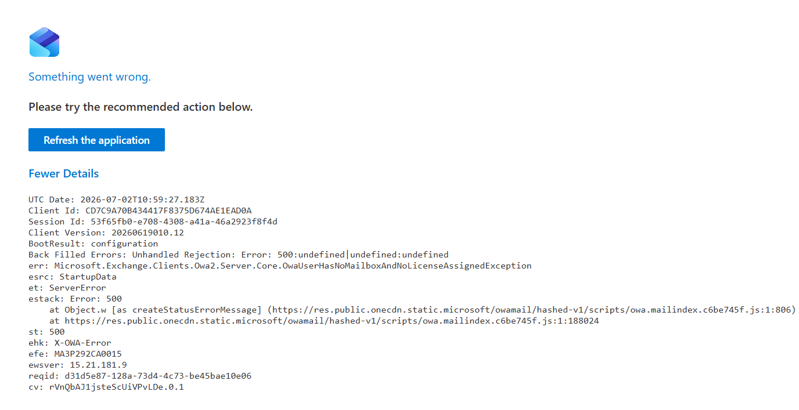
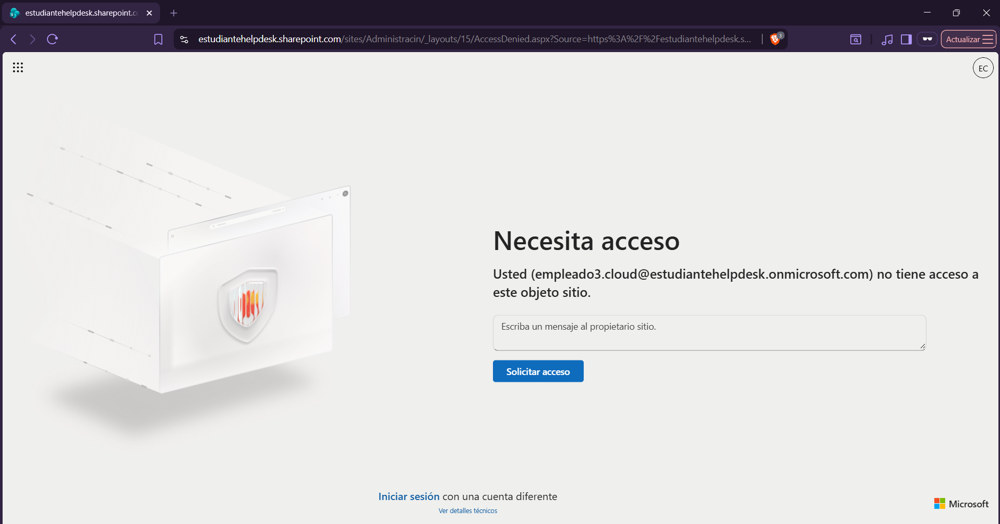
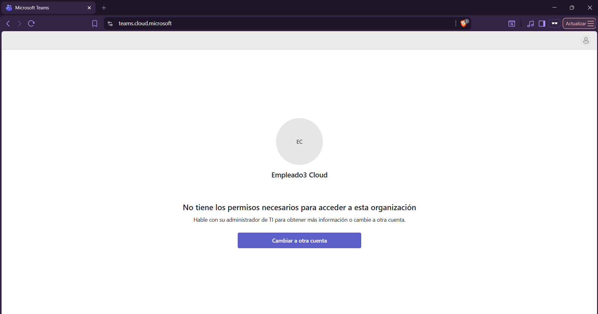

# 🚪 KB-011 | User Offboarding

> Windows Server 2022 • Active Directory • Microsoft 365

## Request

The Human Resources department informed IT that **empleado3** had left the company.

IT was requested to revoke all access to corporate systems, ensuring that the user could no longer access on-premises resources or Microsoft 365 services.

---

## Tasks Performed

### Active Directory

- Disabled the user account
- Removed the user from the **Administration** security group

### Microsoft Entra ID

- Revoked all active user sessions

### Microsoft 365

Removed the following license:

```text
Microsoft 365 Business Premium
```

### Microsoft Teams

Removed the user from:

```text
Administration
```

### SharePoint Online

Removed the user from:

```text
Administration
```

---

## Result

✅ User offboarding completed successfully.

The user can no longer:

- Sign in to the domain
- Access Outlook
- Access Microsoft Teams
- Access SharePoint Online
- Access corporate resources

---

## Evidence

### Disable Active Directory account



### Remove user from security group



### Revoke Microsoft Entra sessions



### Remove Microsoft 365 license



### Remove user from Microsoft Teams



### Remove user from SharePoint



### Disabled account verification



### Outlook access denied



### SharePoint access denied



### Microsoft Teams access denied



---

## Admin Tools

- Active Directory Users and Computers
- Microsoft Entra Admin Center
- Microsoft 365 Admin Center
- Microsoft Teams Admin Center
- SharePoint Online

---

## Skills

- User Offboarding
- Active Directory
- Microsoft Entra ID
- Microsoft 365 Administration
- Microsoft Teams
- SharePoint Online
- Identity and Access Management (IAM)
- Least Privilege Principle
- Helpdesk Operations