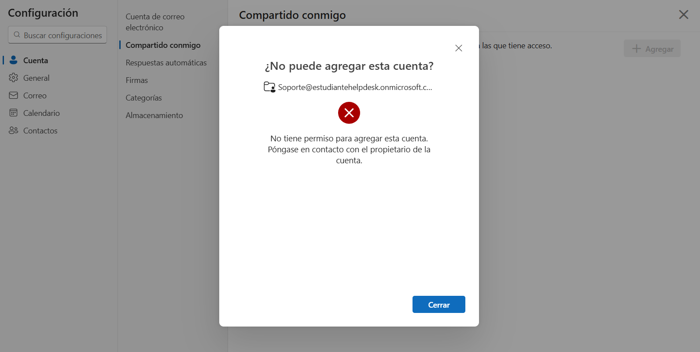
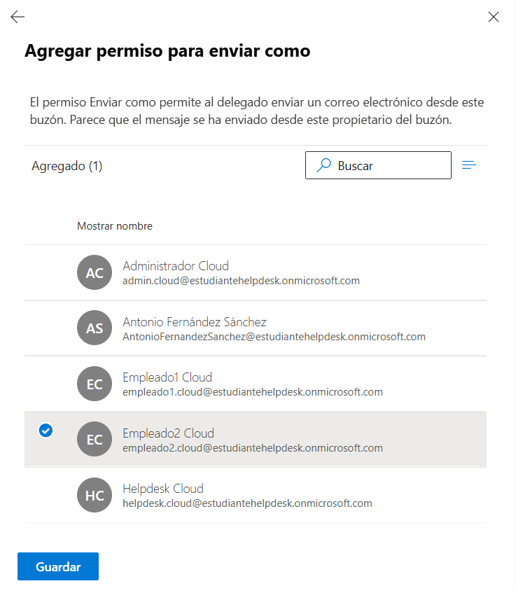
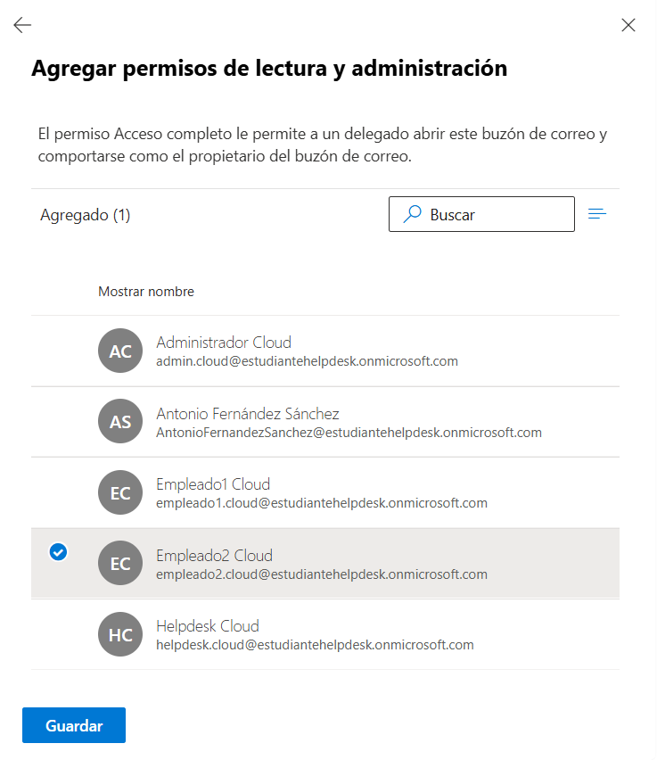
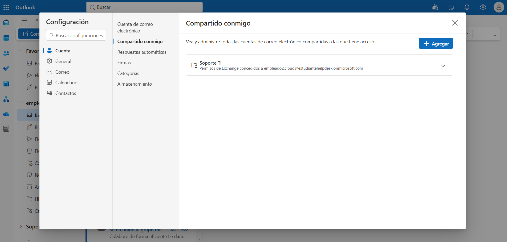
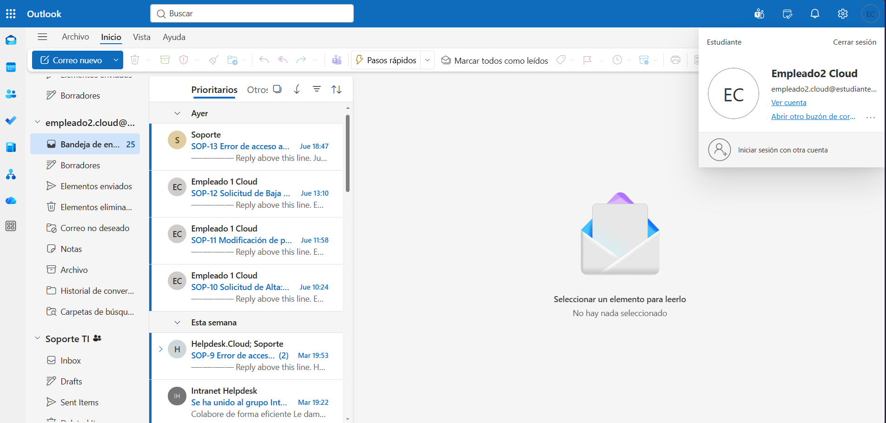
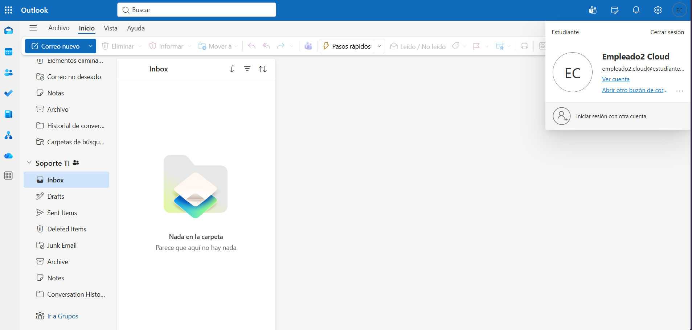
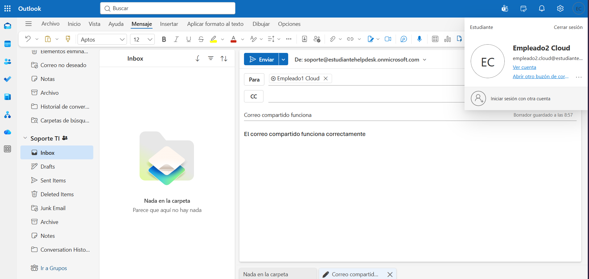

# 📬 KB-012 | Shared Mailbox Access

> Microsoft 365 • Exchange Online • Outlook Web

## Problem

The user (**empleado2.cloud@estudiantehelpdesk.onmicrosoft.com**) reported that they could not access the **Soporte@estudiantehelpdesk.onmicrosoft.com** shared mailbox required for daily IT support operations.

Other users were able to access the mailbox without issues.

---

## Root Cause

The affected user had not been assigned the required permissions on the shared mailbox.

The mailbox was missing:

- Send As
- Read and Manage (Full Access)

permissions.

---

## Resolution

Open the Exchange Admin Center.

Grant the following permissions to the affected user.

```text
Shared Mailbox

Soporte@estudiantehelpdesk.onmicrosoft.com

Permissions

✔ Full Access (Read and Manage)
✔ Send As
```

Wait for permission replication.

Verify access from Outlook Web.

---

## Result

✅ Shared mailbox access restored.

The user successfully:

- Added the shared mailbox
- Opened the mailbox
- Read emails
- Sent emails using the shared mailbox identity

---

## Evidence

### Shared mailbox access error



### Assign Send As permission



### Assign Full Access permission



### Add shared mailbox



### Shared mailbox available in Outlook



### Shared mailbox inbox



### Send email from shared mailbox



---

## Admin Tools

- Microsoft Exchange Admin Center
- Outlook Web
- Microsoft 365 Admin Center

---

## Skills

- Exchange Online
- Shared Mailboxes
- Mailbox Permissions
- Full Access
- Send As
- Outlook Web
- Microsoft 365 Administration
- Helpdesk Troubleshooting