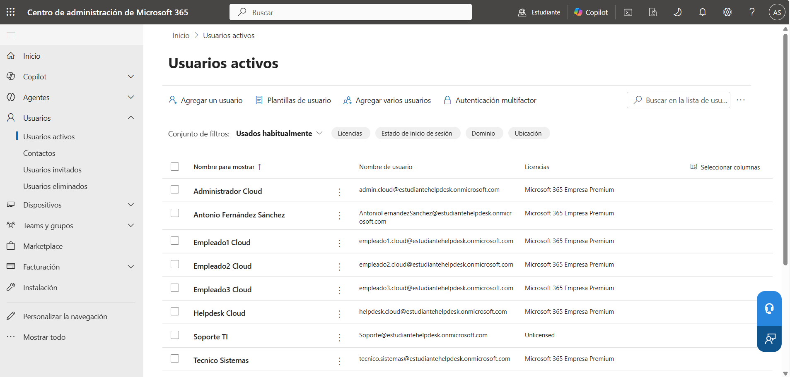
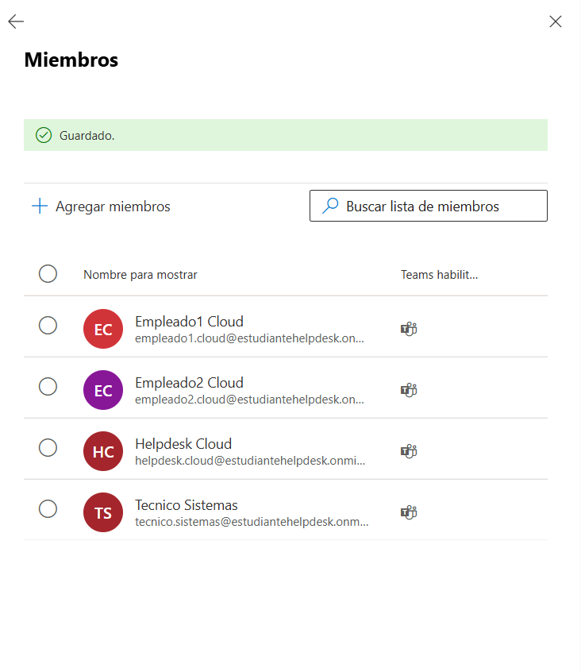
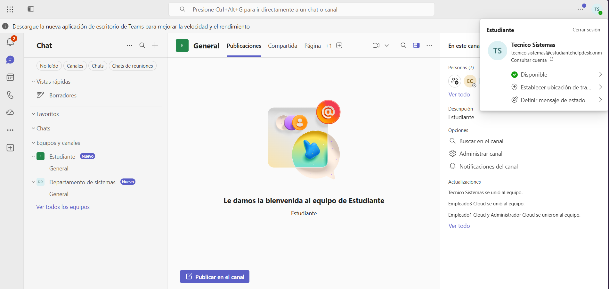
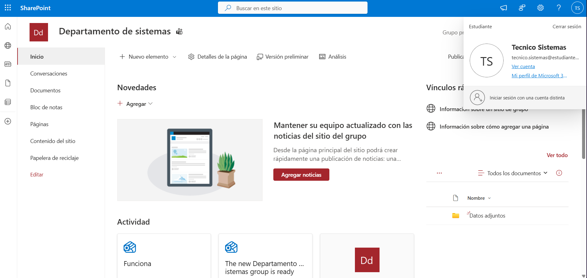
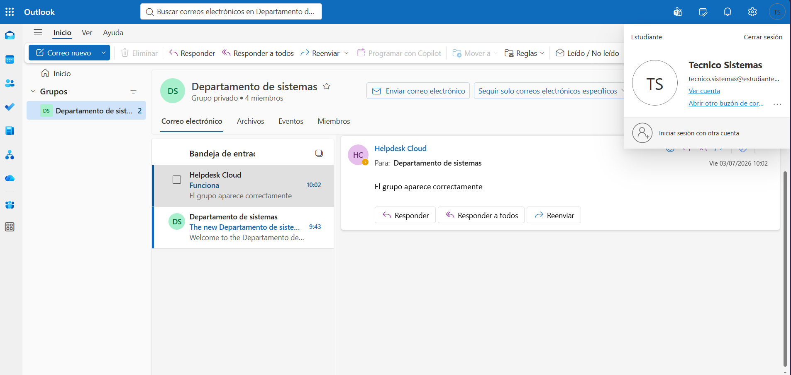

# 👥 KB-013 | Microsoft 365 Group Membership

> Microsoft 365 • Microsoft Teams • SharePoint Online • Outlook

## Request

The IT Manager requested that **tecnico.sistemas** be added to the **Departamento de Sistemas** Microsoft 365 group.

Although the user already had an active Microsoft 365 account and a valid license, they were not yet a member of the group and therefore could not access the team's collaborative resources.

---

## Tasks Performed

Locate the user in the Microsoft 365 Admin Center.

Add the user to the following Microsoft 365 group.

```text
Departamento de Sistemas
```

Verify group membership.

Validate access to:

- Microsoft Teams
- SharePoint Online
- Outlook Group

---

## Result

✅ User successfully added to the Microsoft 365 group.

The user can now:

- Access the Department Team in Microsoft Teams
- Access the Department SharePoint site
- Participate in the Outlook Group
- Collaborate with the rest of the department

---

## Evidence

### Microsoft 365 Active Users



### Add user to Microsoft 365 Group



### Microsoft Teams access



### SharePoint access



### Outlook Group access



---

## Admin Tools

- Microsoft 365 Admin Center
- Microsoft Teams
- SharePoint Online
- Outlook

---

## Skills

- Microsoft 365 Groups
- User Administration
- Microsoft Teams
- SharePoint Online
- Outlook Groups
- Microsoft 365 Administration
- Helpdesk Operations