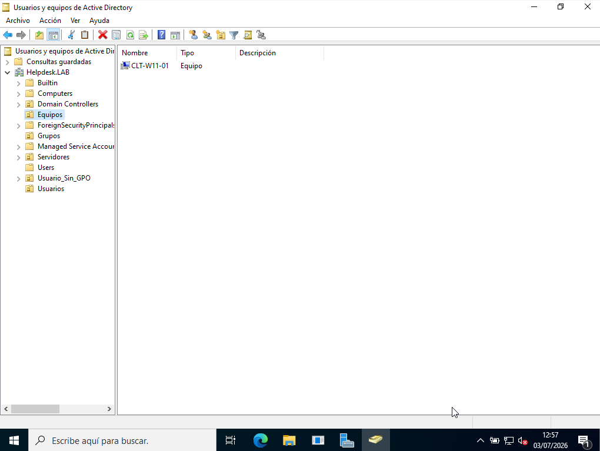
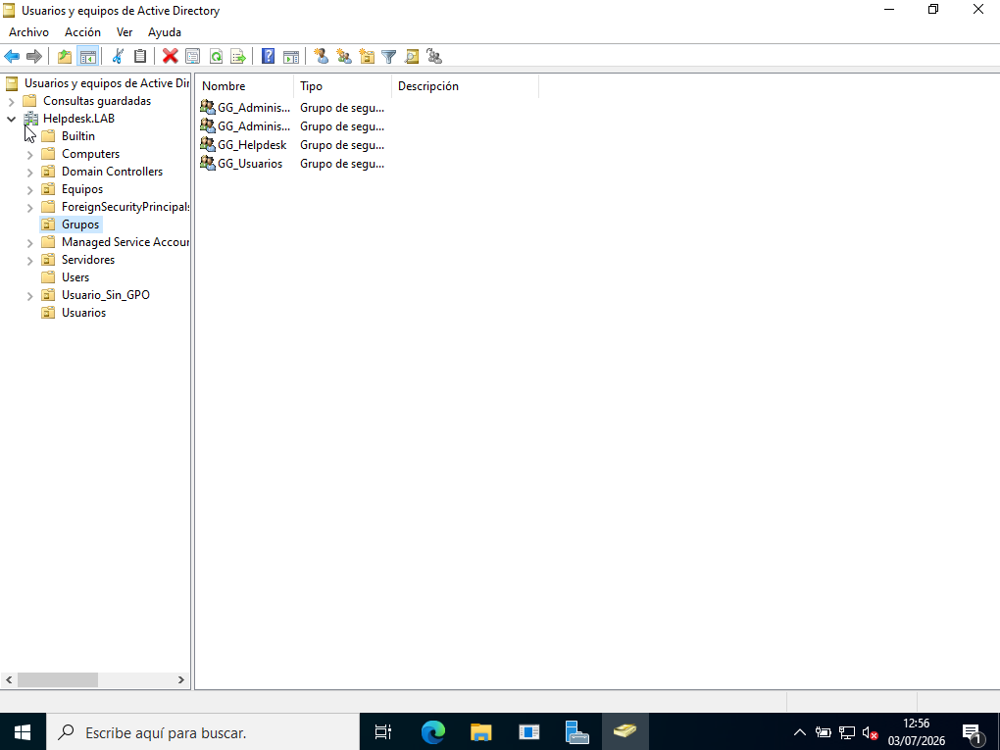

# 🏢 Active Directory

> Windows Server 2022 • Active Directory Domain Services (AD DS)

## Overview

This section documents the Active Directory implementation deployed in the lab.

The domain provides centralized identity management for users, computers and security groups, simulating a typical enterprise environment.

---

## Domain

```text
helpdesk.lab
```

---

## Components

### Organizational Units (OU)

- Equipos
- Usuarios

### Security Groups

- GG_Administración
- GG_Administradores
- GG_Helpdesk
- GG_Usuarios

### Users

- admin.lab
- empleado1
- empleado2
- tecnico.sistemas
- helpdesk

### Computers

- CLT-W11-01

---

## Screenshots

### Domain Computer



### Security Groups



### Domain Users


---

## Skills

- Active Directory Domain Services (AD DS)
- Organizational Units (OU)
- Security Groups
- User Administration
- Computer Management
- Windows Server 2022