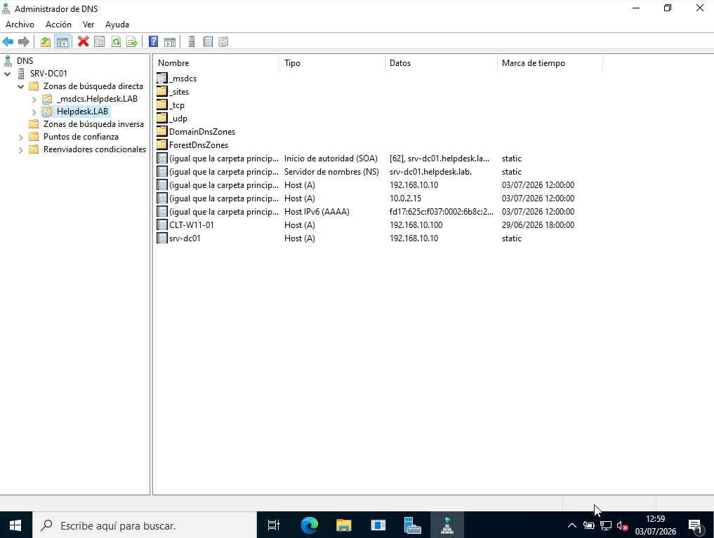
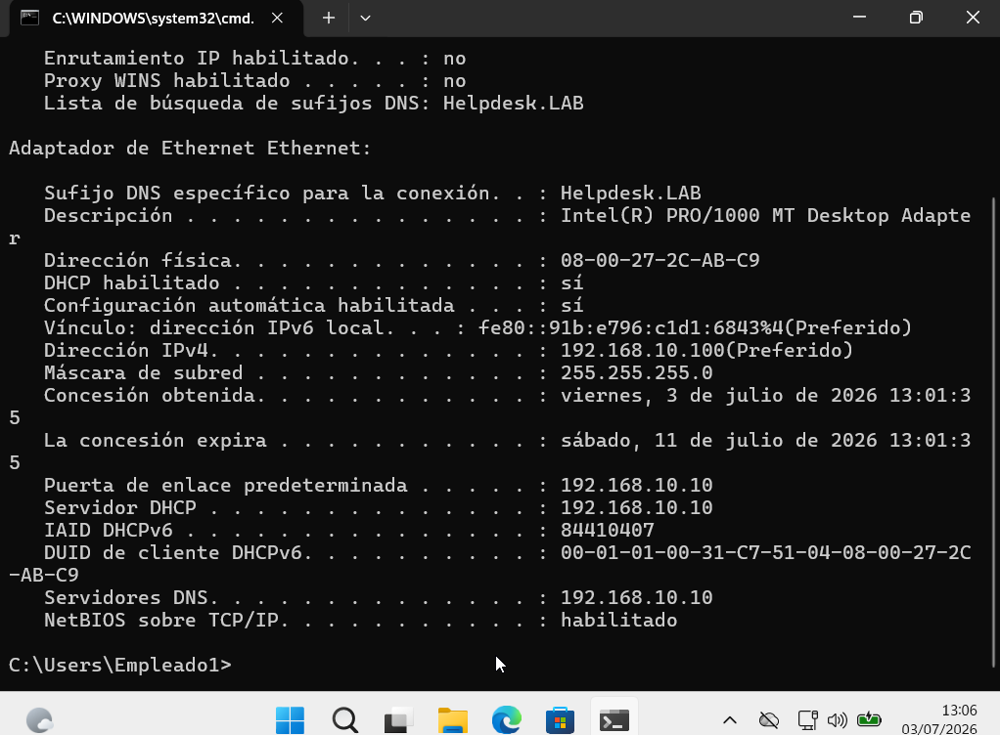
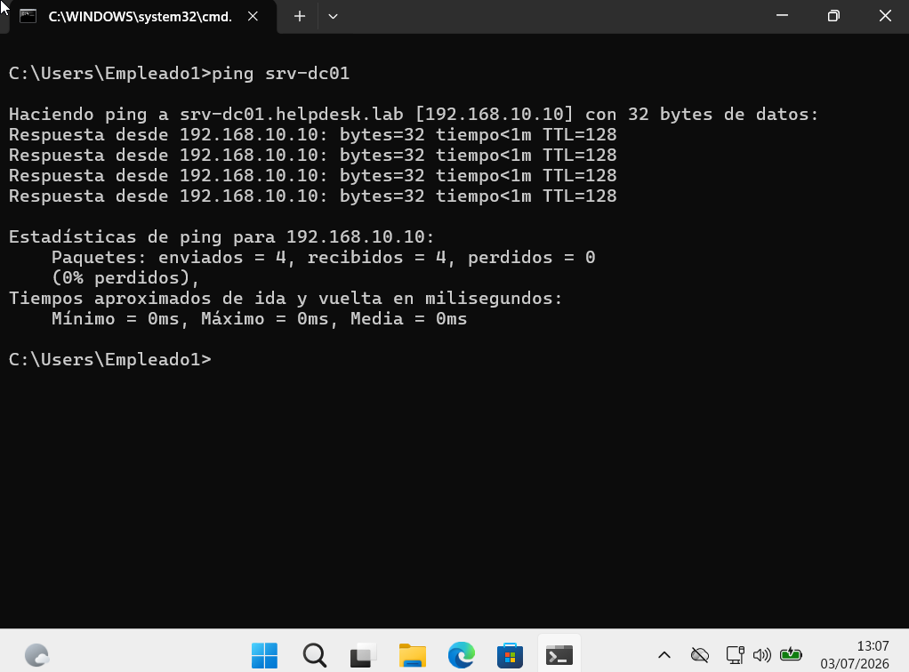

# 🌐 DNS

> Windows Server 2022 • Domain Name System (DNS)

## Overview

This section documents the DNS service configured for the **helpdesk.lab** domain.

The DNS server provides name resolution for domain resources, allowing client computers to locate services such as the domain controller and Active Directory.

---

## DNS Configuration

**DNS Server**

```text
SRV-DC01
```

**Domain**

```text
helpdesk.lab
```

**Zone Type**

```text
Forward Lookup Zone
```

---

## Validation

The following tests were performed to verify the correct operation of the DNS service:

- Verify the client network configuration.
- Verify hostname resolution using **nslookup**.
- Verify network connectivity using **ping**.

---

## Screenshots

### DNS Forward Lookup Zone



### Client Network Configuration



### DNS Name Resolution


### Network Connectivity



---

## Commands Used

```powershell
ipconfig /all

nslookup SRV-DC01

ping SRV-DC01
```

---

## Skills

- Windows Server DNS
- Forward Lookup Zones
- DNS Name Resolution
- TCP/IP Configuration
- Network Troubleshooting
- Windows Server 2022