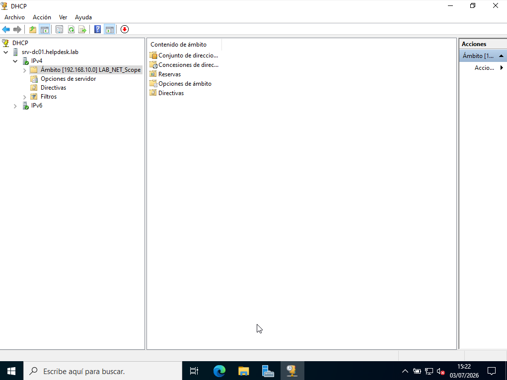
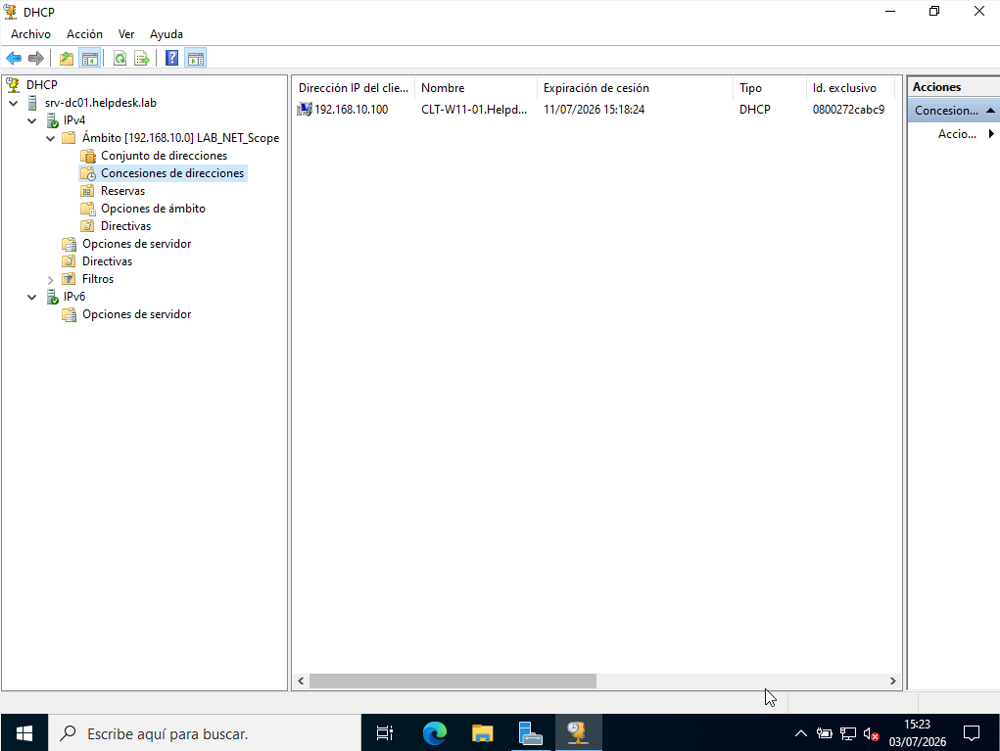
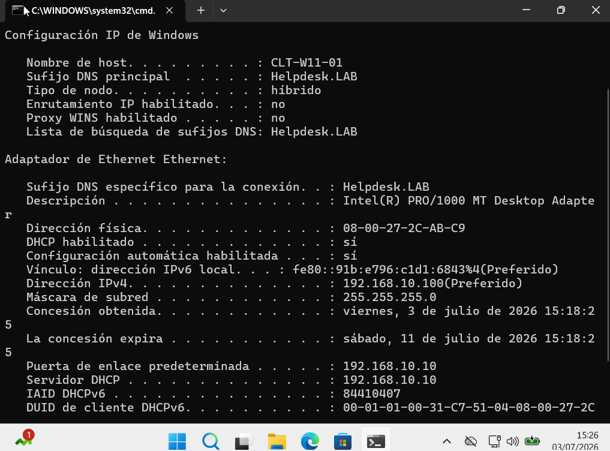
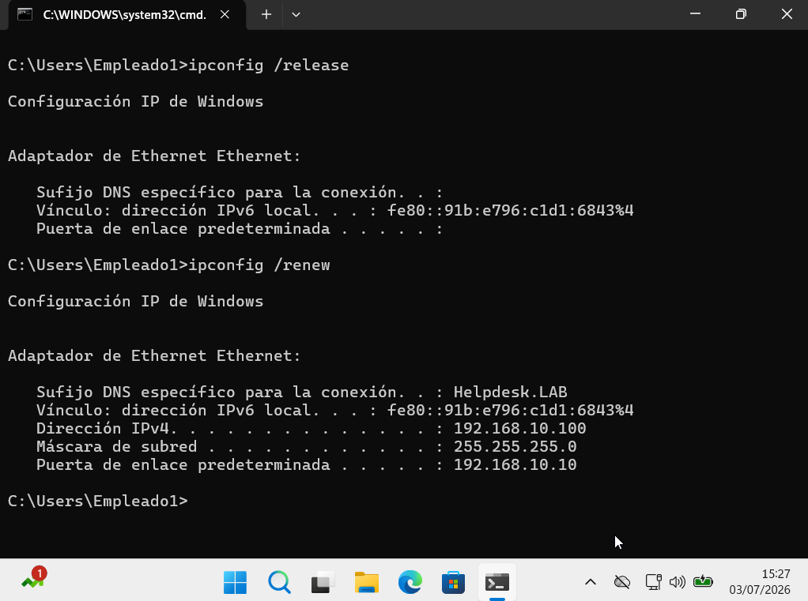

# 📡 DHCP

> Windows Server 2022 • Dynamic Host Configuration Protocol (DHCP)

## Overview

This section documents the DHCP service configured for the **helpdesk.lab** domain.

The DHCP server automatically assigns IP addresses and network configuration to client computers connected to the **LAB_NET** network.

---

## DHCP Configuration

**DHCP Server**

```text
SRV-DC01
```

**Scope**

```text
LAB_NET_Scope
```

**Network**

```text
192.168.10.0/24
```

**Default Gateway**

```text
192.168.10.10
```

---

## Validation

The following tests were performed to verify the correct operation of the DHCP service:

- Verify the DHCP scope configuration.
- Verify active DHCP leases.
- Confirm the client received a valid IP configuration.
- Renew the DHCP lease from the client workstation.

---

## Screenshots

### DHCP Scope



### DHCP Address Leases



### Client Network Configuration



### Renew DHCP Lease



---

## Commands Used

```powershell
ipconfig /all

ipconfig /release

ipconfig /renew
```

---

## Skills

- Windows Server DHCP
- DHCP Scope Configuration
- DHCP Address Leases
- TCP/IP Configuration
- IP Address Management (IPAM)
- Windows Server 2022