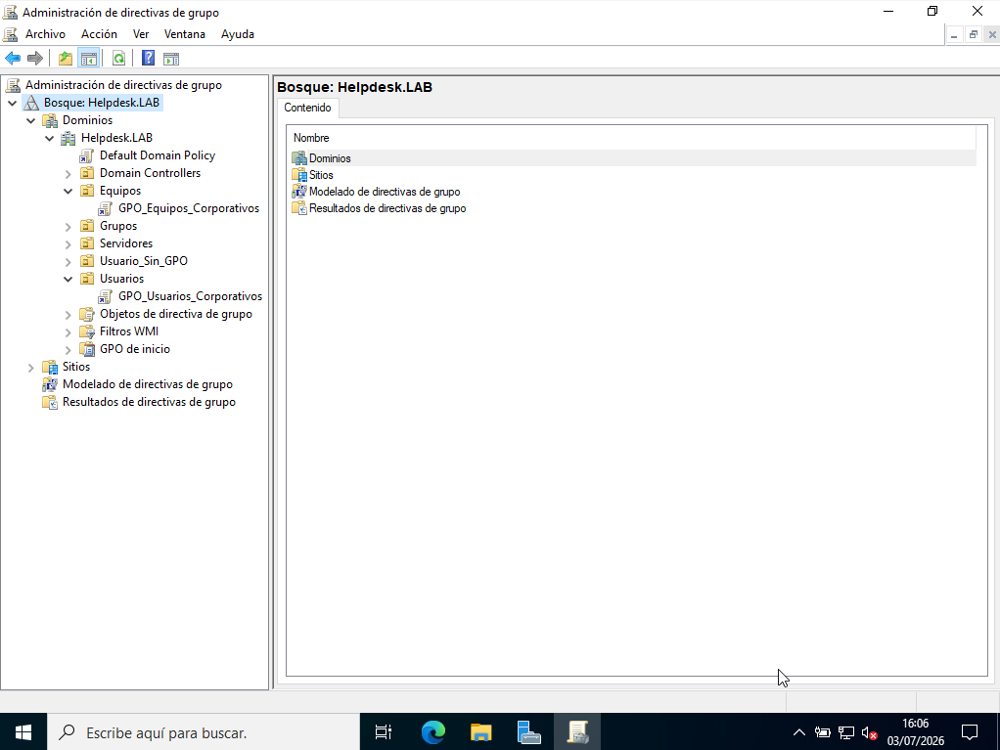
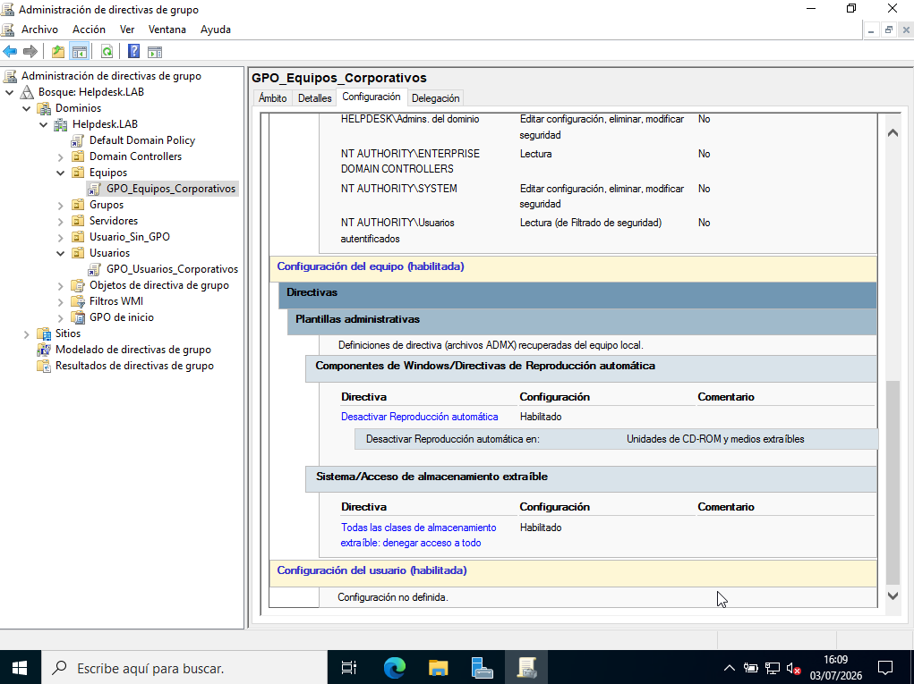
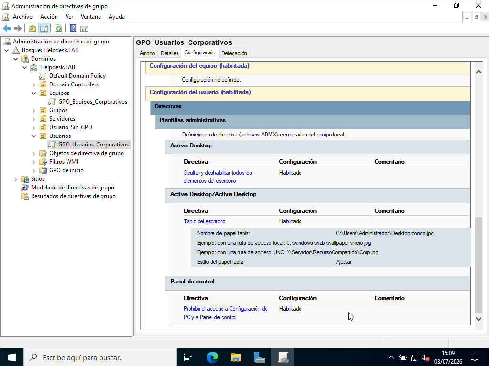
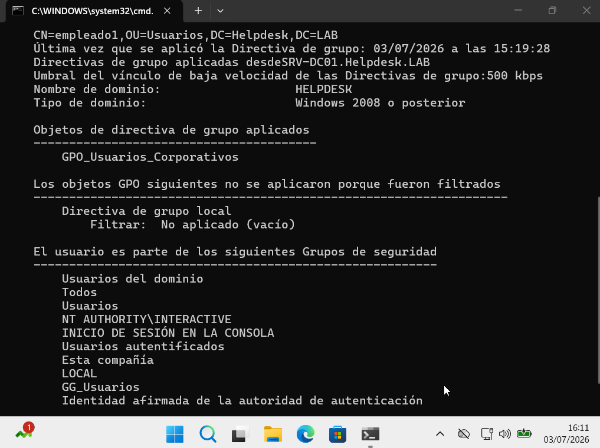
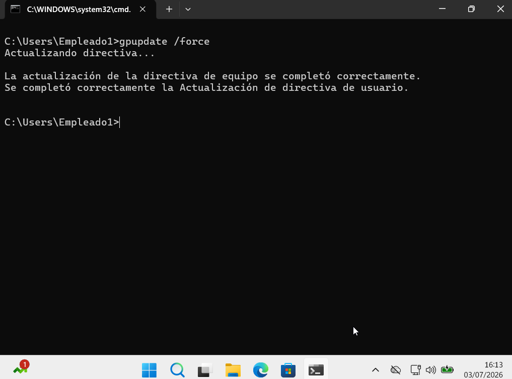

# 🛡️ Group Policy

> Windows Server 2022 • Group Policy Objects (GPO)

## Overview

This section documents the Group Policy infrastructure configured for the **helpdesk.lab** domain.

Group Policy Objects (GPOs) are used to centrally manage security settings, desktop configuration and administrative restrictions for domain users and computers.

---

## Group Policy Configuration

**Domain**

```text
helpdesk.lab
```

**Configured GPOs**

```text
GPO_Equipos_Corporativos
GPO_Usuarios_Corporativos
```

**Linked Organizational Units**

- Equipos
- Usuarios

---

## Validation

The following tests were performed to verify the correct application of Group Policy:

- Review configured Group Policy Objects.
- Verify policy settings.
- Confirm applied policies using **gpresult**.
- Force Group Policy update using **gpupdate**.

---

## Screenshots

### Group Policy Management



### Computer GPO Configuration



### User GPO Configuration



### Verify Applied Policies



### Force Group Policy Update



---

## Commands Used

```powershell
gpresult /r

gpupdate /force
```

---

## Skills

- Group Policy Management
- Group Policy Objects (GPO)
- Organizational Units (OU)
- Security Configuration
- Centralized Administration
- Windows Server 2022