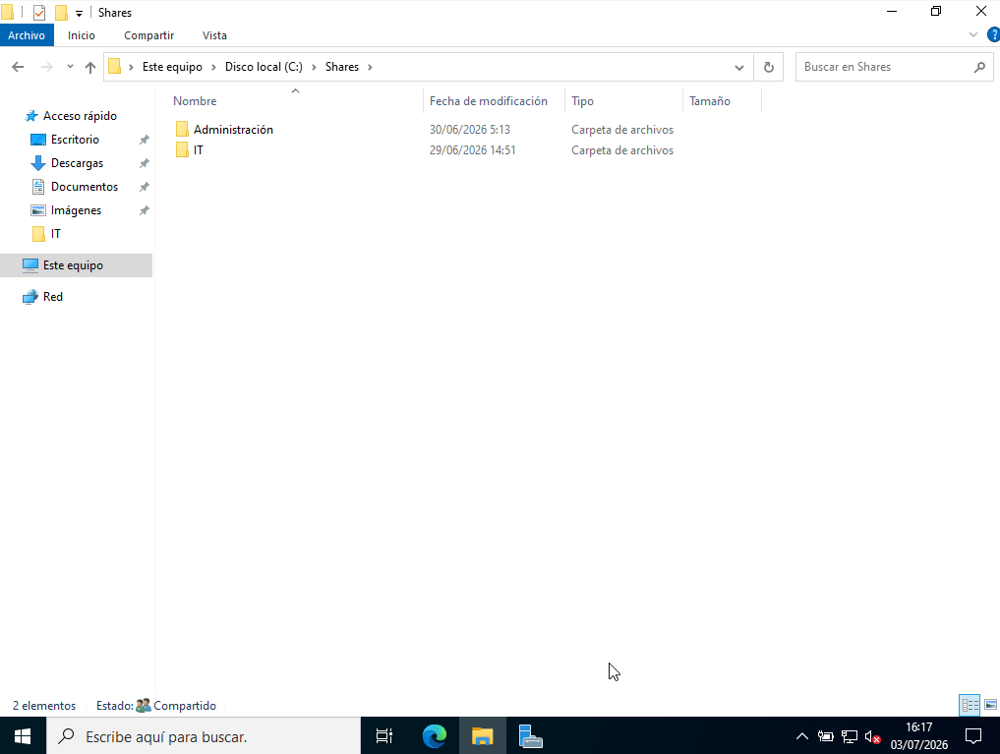
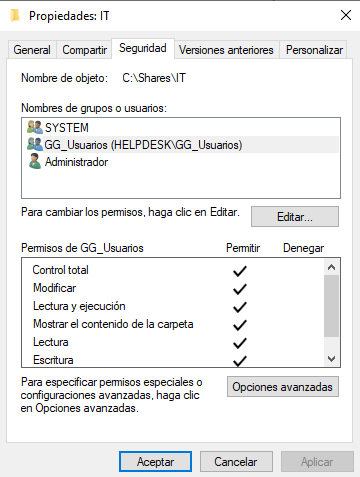
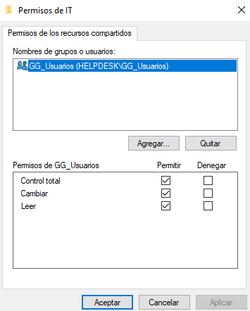
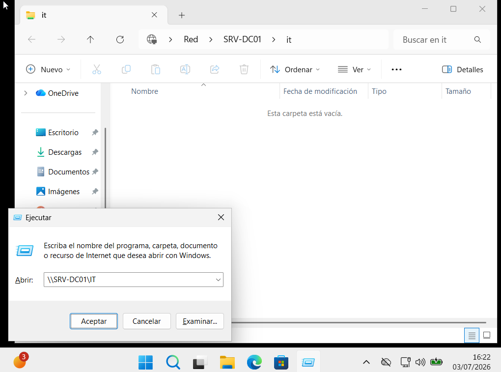

# 📁 File Server

> Windows Server 2022 • File and Storage Services

## Overview

This section documents the File Server implementation configured for the **helpdesk.lab** domain.

Shared folders were created to provide centralized file storage for different departments. Access is controlled using Active Directory security groups together with NTFS and Share permissions.

---

## File Server Configuration

**Server**

```text
SRV-DC01
```

**Shared Folder**

```text
IT
```

**Security Group**

```text
GG_Usuarios
```

---

## Validation

The following tests were performed to verify the correct operation of the File Server:

- Verify the shared folder structure.
- Review NTFS permissions.
- Review Share permissions.
- Confirm client access using a domain user.

---

## Screenshots

### Shared Folder Structure



### NTFS Permissions



### Share Permissions



### Client Access Verification



---

## Skills

- Windows File Server
- Shared Folders
- NTFS Permissions
- Share Permissions
- Active Directory Security Groups
- Access Control
- Windows Server 2022