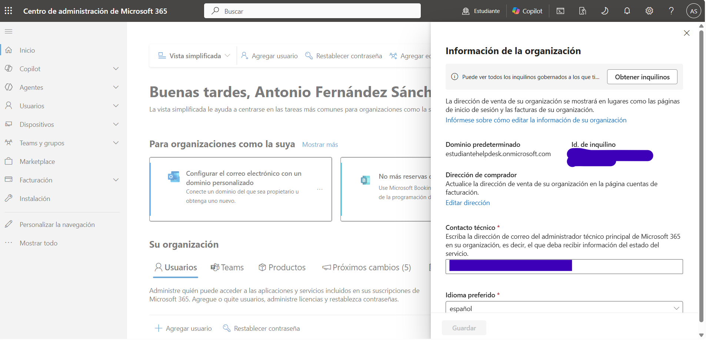
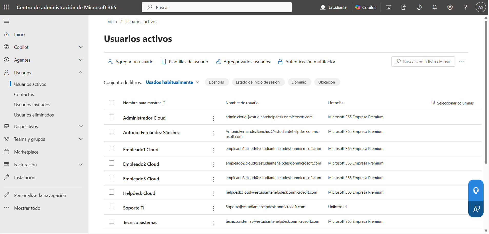
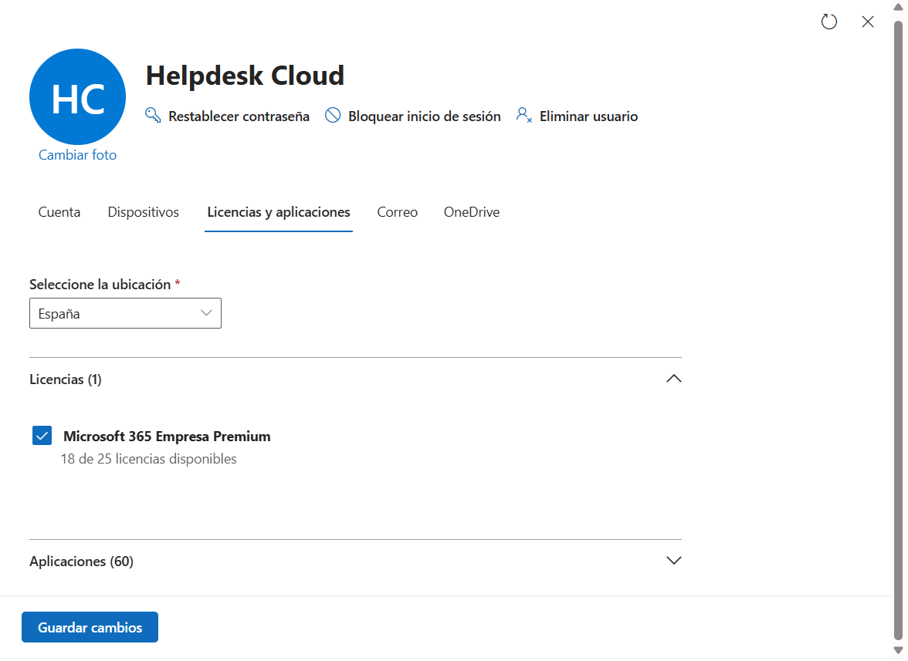

# ☁️ Microsoft 365

> Microsoft 365 • Microsoft Entra ID • Microsoft 365 Admin Center

## Overview

This section documents the Microsoft 365 tenant configured for the hybrid lab environment.

The tenant provides cloud identity, user management and licensing services, enabling access to Microsoft 365 applications such as Outlook, Teams and SharePoint Online.

---

## Microsoft 365 Configuration

**Tenant**

```text
estudiantehelpdesk.onmicrosoft.com
```

**Administration Portal**

```text
Microsoft 365 Admin Center
```

**License**

```text
Microsoft 365 Business Premium
```

---

## Validation

The following checks were performed to verify the Microsoft 365 environment:

- Verify tenant information.
- Review active users.
- Confirm Microsoft 365 license assignment.

---

## Screenshots

### Organization Information



### Active Users



### Microsoft 365 License Assignment



---

## Admin Tools

- Microsoft 365 Admin Center
- Microsoft Entra Admin Center

---

## Skills

- Microsoft 365 Administration
- Microsoft Entra ID
- User Management
- License Management
- Microsoft 365 Business Premium
- Cloud Administration