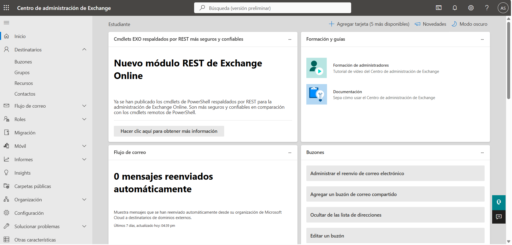
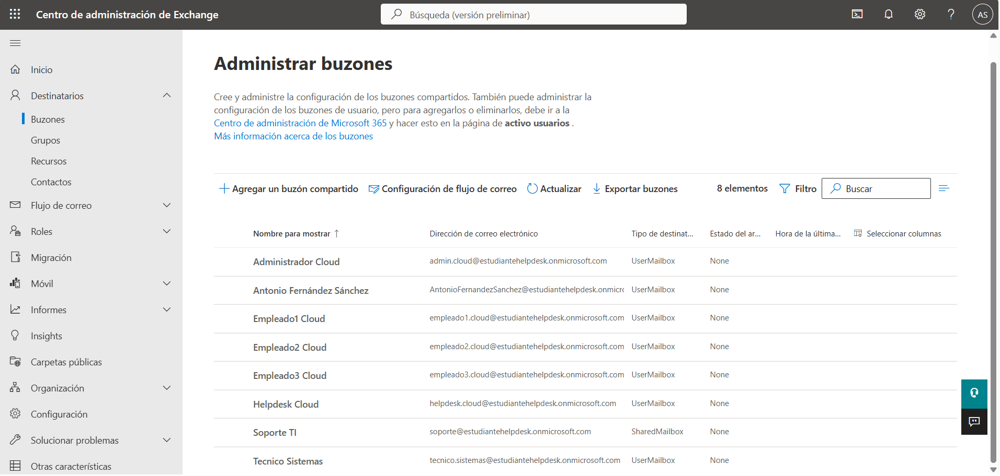
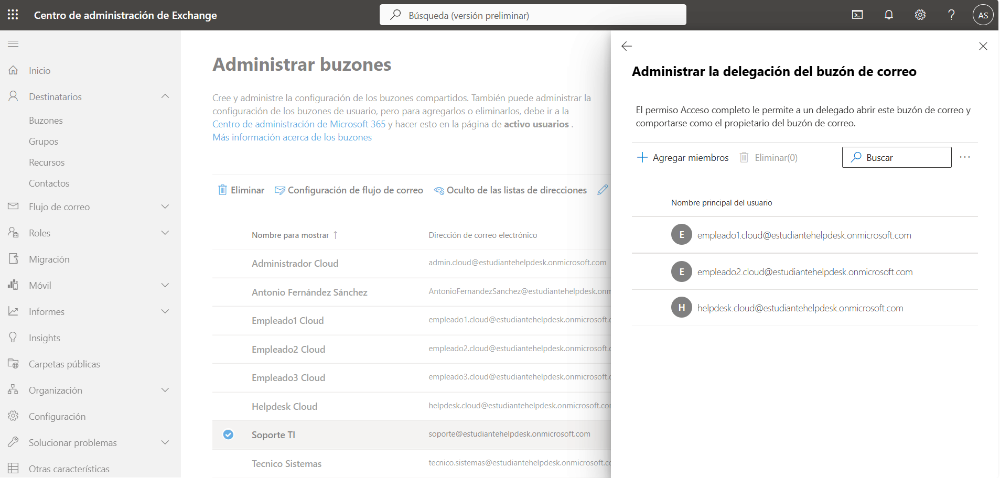
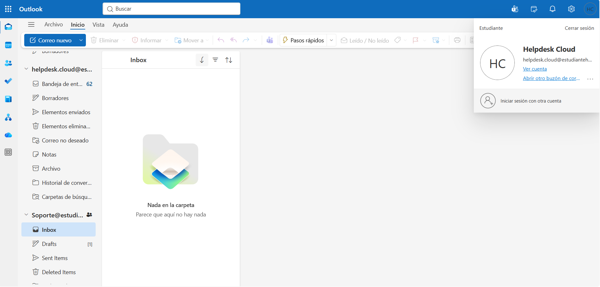

# 📧 Exchange Online

> Microsoft 365 • Exchange Online • Outlook

## Overview

This section documents the Exchange Online implementation configured for the hybrid lab environment.

Exchange Online provides cloud-based email services, including user mailboxes, shared mailboxes and permission management for collaborative communication within the organization.

---

## Exchange Online Configuration

**Platform**

```text
Exchange Online
```

**Shared Mailbox**

```text
Soporte@estudiantehelpdesk.onmicrosoft.com
```

**Mailbox Permissions**

- Full Access
- Send As

---

## Validation

The following checks were performed to verify the Exchange Online configuration:

- Verify the Exchange Admin Center.
- Review shared mailbox configuration.
- Verify mailbox delegation permissions.
- Confirm access to the shared mailbox from Outlook.

---

## Screenshots

### Exchange Admin Center



### Shared Mailbox



### Send As Permission


### Full Access Permission



### Shared Mailbox in Outlook



---

## Admin Tools

- Exchange Admin Center
- Microsoft 365 Admin Center
- Outlook Web

---

## Skills

- Exchange Online
- Shared Mailboxes
- Mailbox Delegation
- Full Access Permission
- Send As Permission
- Outlook
- Microsoft 365 Administration