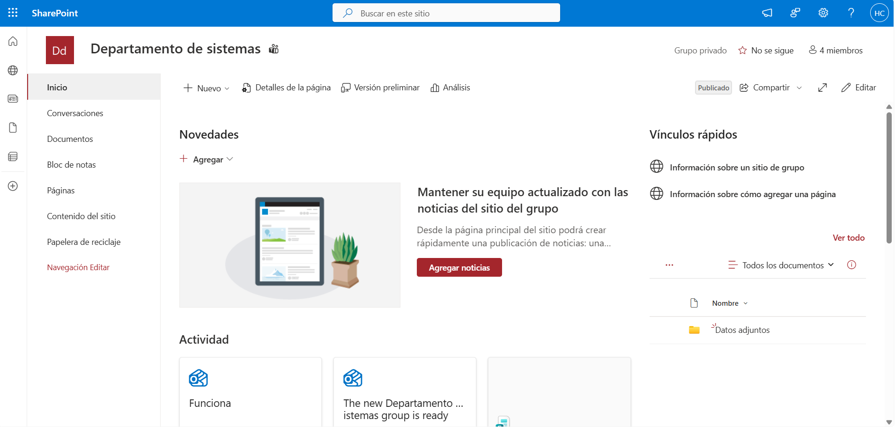
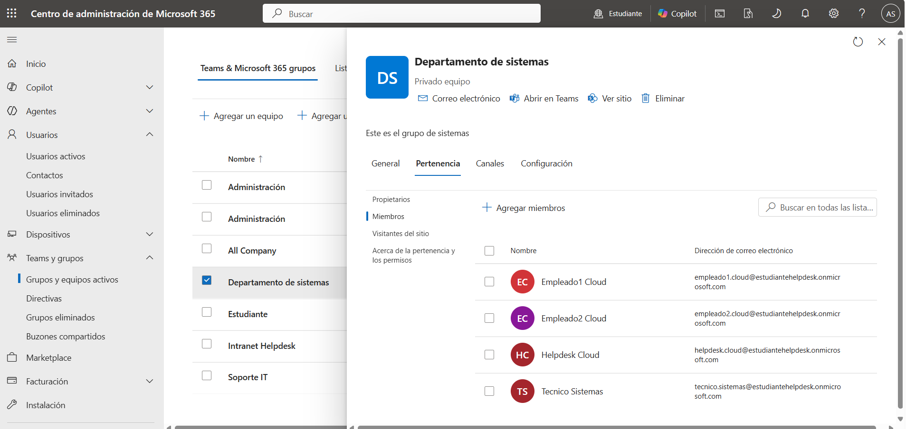
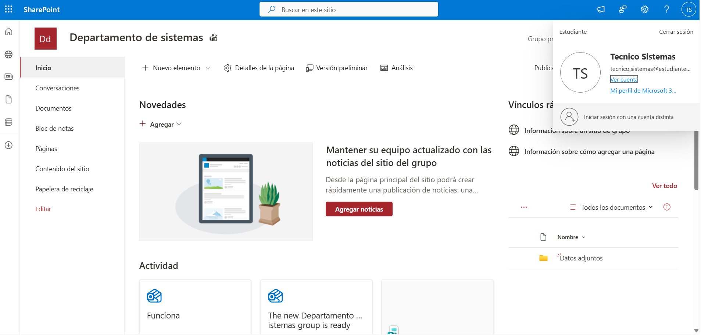
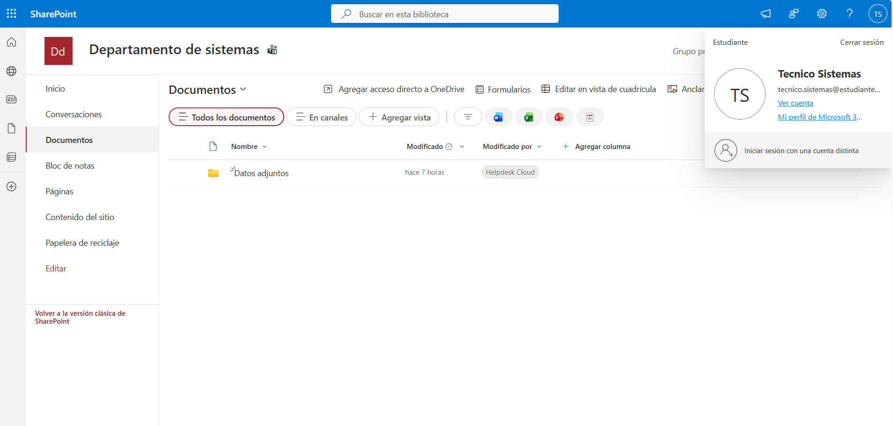

# 📂 SharePoint Online

> Microsoft 365 • SharePoint Online

## Overview

This section documents the SharePoint Online implementation configured for the hybrid lab environment.

The **Departamento de Sistemas** site provides a centralized workspace where team members can access, manage and collaborate on corporate documentation and shared resources.

---

## SharePoint Configuration

**Site**

```text
Departamento de Sistemas
```

**Access Model**

```text
Microsoft 365 Group Membership
```

**Document Library**

```text
Documents
```

---

## Validation

The following checks were performed to verify the SharePoint Online implementation:

- Verify the SharePoint site.
- Review Microsoft 365 Group membership.
- Confirm user access to the site.
- Verify access to the document library.

---

## Screenshots

### SharePoint Site



### Microsoft 365 Group Members



### User Access Verification



### Document Library



---

## Admin Tools

- SharePoint Online
- Microsoft 365 Admin Center

---

## Skills

- SharePoint Online
- Site Administration
- Document Libraries
- Microsoft 365 Groups
- Permission Management
- Collaboration Services
- Microsoft 365 Administration