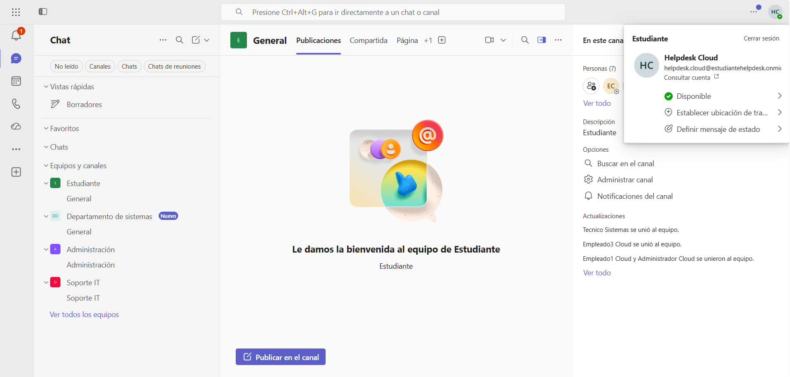
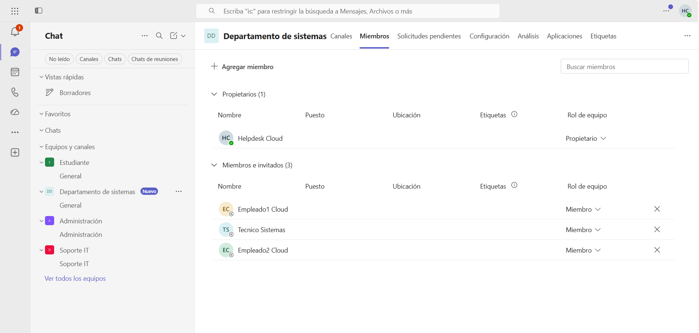
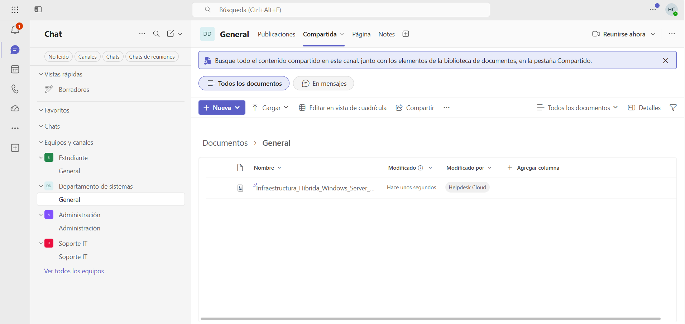

# 💬 Microsoft Teams

> Microsoft 365 • Microsoft Teams

## Overview

This section documents the Microsoft Teams environment configured for the hybrid lab.

Teams provides collaboration services through department-based teams, enabling users to communicate, share files and work together using Microsoft 365 integrated services.

---

## Microsoft Teams Configuration

**Team**

```text
Departamento de Sistemas
```

**Membership**

```text
Managed through Microsoft 365 Groups
```

**Integrated Services**

- Team Channels
- File Sharing
- SharePoint Online
- Microsoft 365 Groups

---

## Validation

The following checks were performed to verify the Microsoft Teams configuration:

- Verify the available teams.
- Review team membership.
- Confirm access to shared files.

---

## Screenshots

### Microsoft Teams Home



### Team Members



### Shared Files



---

## Admin Tools

- Microsoft Teams
- Microsoft Teams Admin Center
- Microsoft 365 Admin Center

---

## Skills

- Microsoft Teams
- Team Management
- Microsoft 365 Groups
- File Collaboration
- SharePoint Online Integration
- Microsoft 365 Administration