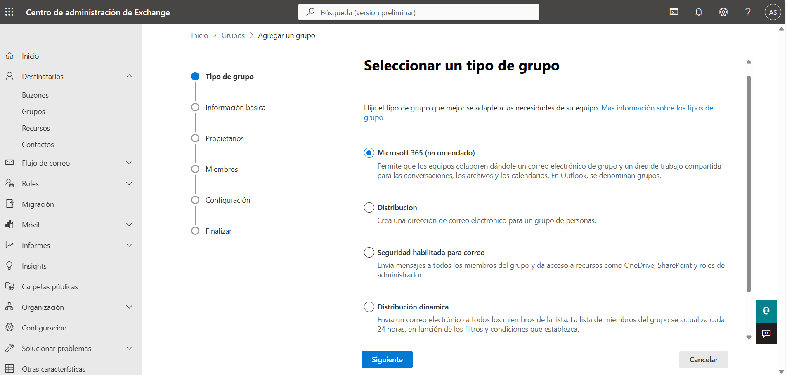
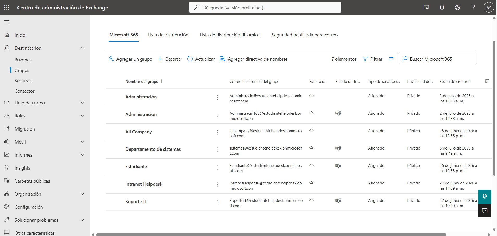
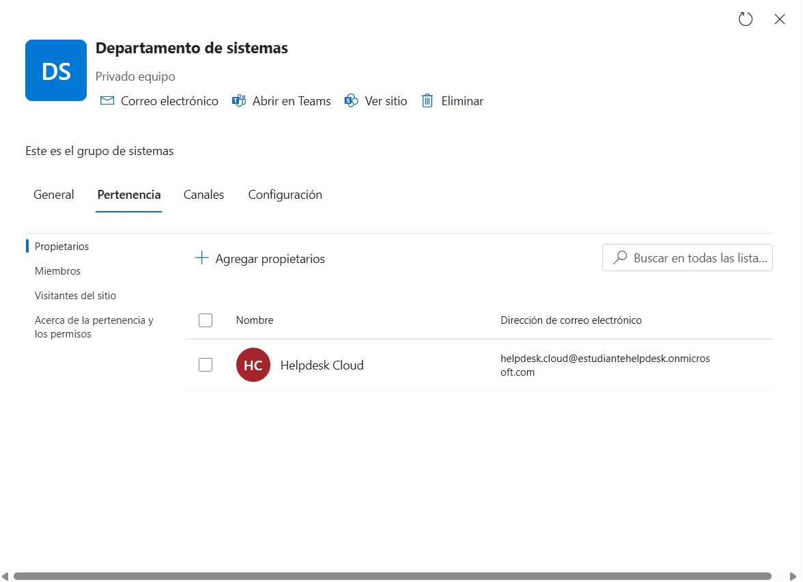
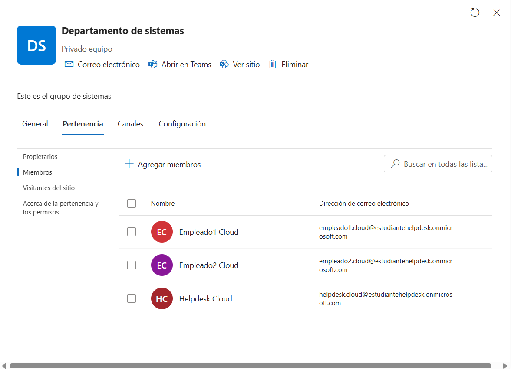
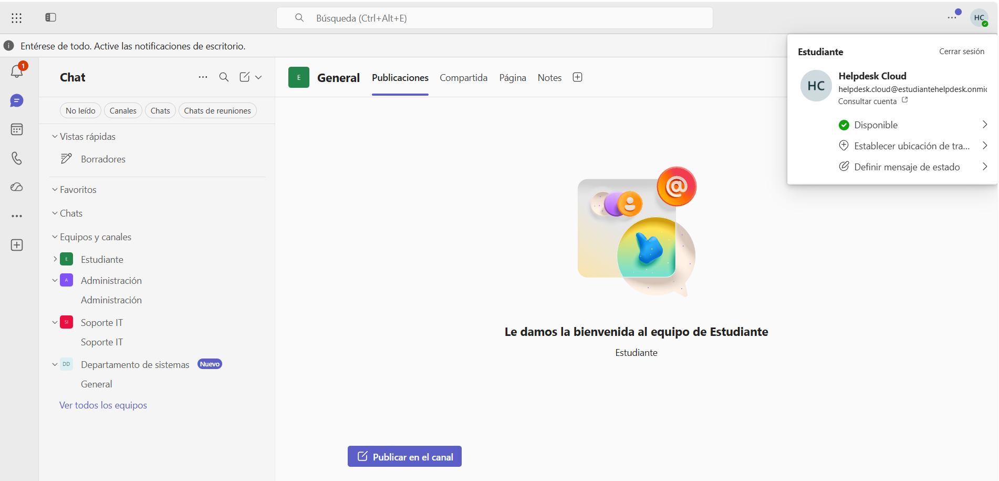
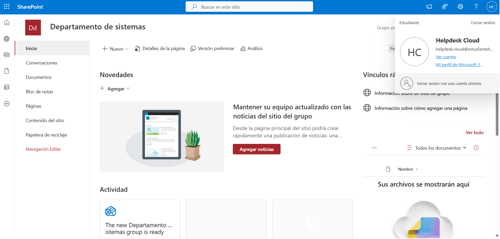
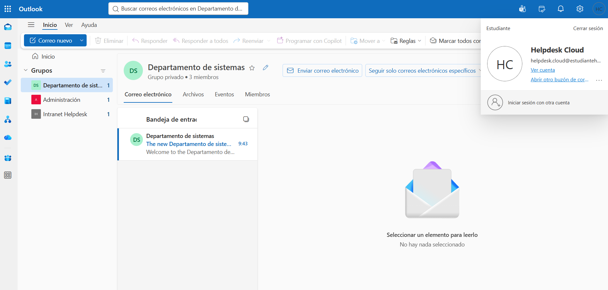

# 👥 Microsoft 365 Groups

> Microsoft 365 • Exchange Online • Microsoft Teams • SharePoint Online

## Overview

This section documents the implementation of a **Microsoft 365 Group** within the hybrid lab environment.

The **Departamento de Sistemas** group was created to provide centralized collaboration services for the Systems Department. A single Microsoft 365 Group automatically provisions shared resources across Microsoft Teams, SharePoint Online and Outlook.

---

## Services Integrated

- Microsoft Teams
- SharePoint Online
- Outlook Group
- Shared Calendar
- Group Membership Management

---

## Implementation

The following tasks were completed:

- Created the **Departamento de Sistemas** Microsoft 365 Group.
- Configured the group owner.
- Added department members.
- Verified Microsoft Teams integration.
- Verified SharePoint Online integration.
- Verified Outlook Group integration.

---

## Screenshots

### Create Microsoft 365 Group

### Microsoft 365 Groups overview

### Group owner

### Group members

### Microsoft Teams integration

### SharePoint integration

### Outlook integration

---

## Skills

- Microsoft 365 Groups
- Microsoft 365 Administration
- Microsoft Teams
- SharePoint Online
- Exchange Online
- User and Group Management