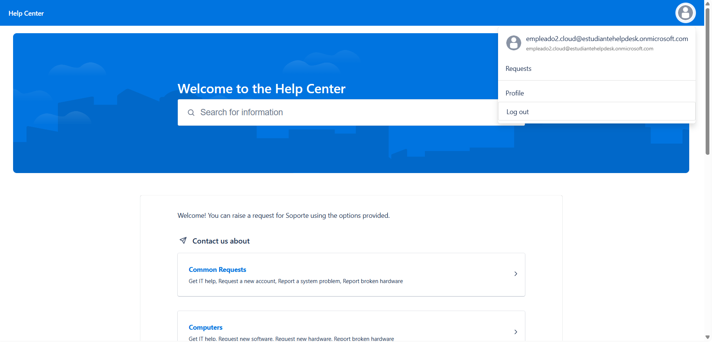
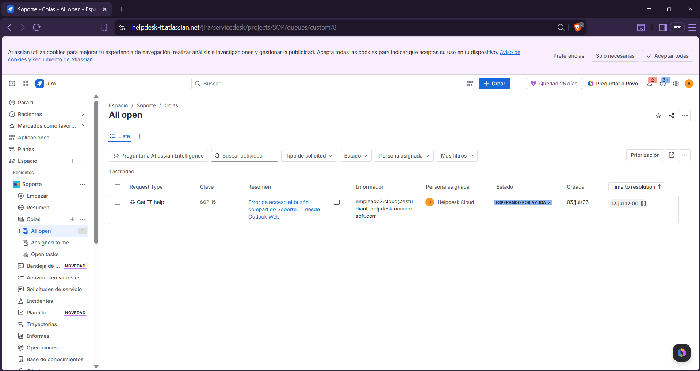
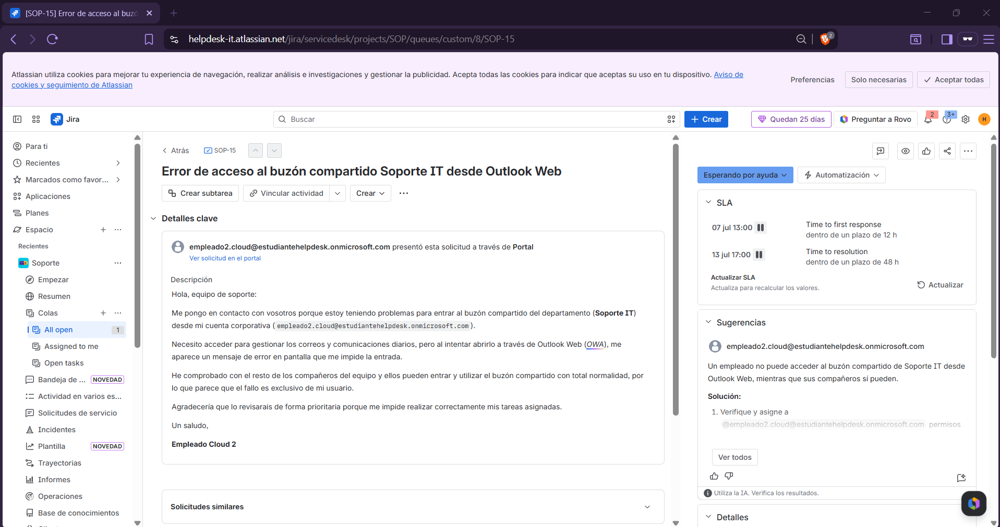

# 🎫 Jira Service Management

> Atlassian • Jira Service Management • IT Service Management (ITSM)

## Overview

This section documents the Jira Service Management environment configured for the hybrid lab.

The platform provides an IT service desk where users can submit support requests, technicians can manage incidents, and customers can track the status of their tickets throughout the resolution process.

---

## Service Desk Configuration

**Platform**

```text
Jira Service Management
```

**Project**

```text
Soporte Técnico
```

**Workflow**

```text
Customer Portal
        ↓
Ticket Creation
        ↓
Support Queue
        ↓
Technician Resolution
        ↓
Customer Confirmation
```

---

## Validation

The following checks were performed to verify the service desk workflow:

- Verify access to the customer portal.
- Review incoming tickets in the support queue.
- Manage and resolve incidents from the technician view.
- Confirm the resolved ticket from the customer portal.

---

## Screenshots

### Customer Portal



### Support Queue



### Ticket Details



### Customer View (Resolved)


---

## Admin Tools

- Jira Service Management
- Atlassian Cloud

---

## Skills

- Jira Service Management
- IT Service Management (ITSM)
- Incident Management
- Ticket Lifecycle
- Customer Support
- Helpdesk Operations